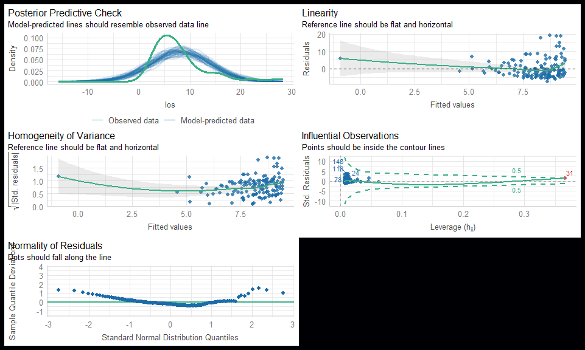

``` r
  library(tidyverse)
  library(viridis)
  library(knitr)
  library(gtsummary)
  library(sjPlot)
  library(patchwork)
  library(ggrain)
  library(performance) # https://easystats.github.io/performance/
  library(lmtest)
  library(broom)
  library(faux) # https://debruine.github.io/project/faux/
```


``` r
# Set colors/theme for plots

  col1 <- viridis(1, option = "A", end = 0.9, dir = -1)
  col2 <- viridis(1, option = "A")
# col3 <- viridis(1, option = "A", begin = 0.4)
  col3 <- "#21091F"
  col4 <- viridis(1, option = "A", begin = 0.6)
  col5 <- viridis(1, option = "A", begin = 0.1)

  my_theme <- theme_minimal() +
    theme(
      panel.background = element_rect(fill = col2), 
      axis.text = element_text(color = col1),
      axis.title = element_text(color = col1),
      plot.background = element_rect(fill = col2), 
      legend.background = element_rect(fill = col2), 
      legend.text = element_text(color = col4), 
      legend.title = element_text(color = col4), 
      axis.ticks = element_line(color = col1), 
      title = element_text(color = col1), 
      panel.grid = element_line(color = col3), 
      strip.text = element_text(color = col1), 
      plot.subtitle = element_text(color = col1),
      plot.caption = element_text(hjust = 0)
      )
  
  theme_set(my_theme)
```

# Preface

While this tutorial will feature examples and exercises using real data from a variety of sources, we will also rely heavily on simulated data. The ability to easily simulate data under various assumptions is a key advantage of using R, and it can be helpful to build and interpret models in situations where we know the "truth" simply because we simulated it for ourselves. 

We will also rely heavily on data visualization. The ability to make high quality visualizations is another key strength of R and an important skill in it's own right. Further, being able to "see" the data can help us avoid getting lost in the abstractions of mathematical equations, and to quickly spot mistakes in the data and/or our analysis that might be hidden by numerical summaries of data or results. In particular, we want to make it a standard practice to always visualize the predictions generated by our models in relation to the data we actually observed or simulated.  

# Linear regression models

- Slope of a line
- Random variables and statistical models
- The linear regression equation(s)
  - What's fixed and what's random
    - Decomposition of variance
    - Residuals
  - What's indexed by observation and what's shared
  - Terminology
    - Intercept and slope coefficients
    - Predictors/independent variables; Outcomes/predictands/dependent variables
  - Estimation, or fitting, of models
    - Closed form solutions
    - Least squares
    - Gradient decent
    - Maximum likelihood estimation
- Purposes
  - Prediction
  - Inference

### Single group / intercept only

The simplest regression model we can estimate would have no predictors, and thus no slope coefficients. This leaves the the shared intercept term $\alpha$ and the errors $\epsilon_{i} \sim Norm(0, \sigma^2)$. 

$Y_{i}=\alpha+\epsilon_{i}; \epsilon_{i} \sim Norm(0, \sigma^2)$

A Bayesian might even make this connection between a linear regression and a Normal model more explicit by describing the model as:

$Y_{i} \sim Norm(\alpha, \sigma^2)$

This means we can use a linear regression model in R to estimate the mean and standard deviation for some random variable $Y$.

First, we'll simulate a simple dataset with a single outcome variable that we generate from a normal distribution with a mean and SD of 1. 


``` r
  set.seed(1207) 
# Note: Any time you use a function that does something at random, like
# simulating data, or extracting random samples from larger datasets, you
# typically want to set the seed so you or someone else can replicate your
# specific results.

  data <- data_frame(
    y = rnorm(100, 0, 1)
    )
  
# rnorm(100, 0, 1) will generate 100 values from a normal distribution with a
# mean of zero and a SD of one.
```

First, let's visualize these data we've just simulated. 

Two good options for looking at continuous variables are: 

- A jitter plot that shows all the data points, with a box plot to summarize the descriptive statistics for their distribution  (left panel)

- A density plot to focus on the shape of the distribution, with a rug plot (the ticks) to show the values of the actual data points. 


``` r
  g1 <- data |>
    ggplot(aes(y = y, x = 1)) +
      geom_jitter(width = 0.1, alpha = 0.5, color = col4) +
      geom_boxplot(fill = NA, width = 0.5, color = col4, outlier.alpha = 0) +
      geom_point(
        data = data |> summarise(y = mean(y)), 
        size = 5, 
        color = col1
        ) +
      xlab("") +
      theme(
        axis.text.x = element_blank(), 
        axis.ticks.x = element_blank()
        )

  g2 <- data |>
    ggplot(aes(x = y)) +
      geom_density(alpha = 0.5, fill = col4) + 
      geom_rug(color = col1) +
      geom_vline(
        data = data |> summarise(y = mean(y)),
        aes(xintercept = y), color = col1
        ) +  
      coord_flip() + 
    # This flips the plot so the Y axes from the g1 and g2 match 
      xlab("")
    # Remove this axis label since it's not needed after combining it with g1
  
# The two plots we just created are then combined using the patchwork package. 
# https://patchwork.data-imaginist.com/
  g1 + g2
```

<!-- -->


``` r
  m1 <- lm(y ~ 1, data = data)
```


``` r
  m1
```

```
## 
## Call:
## lm(formula = y ~ 1, data = data)
## 
## Coefficients:
## (Intercept)  
##    -0.05378
```


``` r
  mean(data$y)
```

```
## [1] -0.05377657
```


``` r
  summary(m1)
```

```
## 
## Call:
## lm(formula = y ~ 1, data = data)
## 
## Residuals:
##      Min       1Q   Median       3Q      Max 
## -2.53112 -0.56335 -0.02325  0.70807  2.42283 
## 
## Coefficients:
##             Estimate Std. Error t value Pr(>|t|)
## (Intercept) -0.05378    0.10203  -0.527    0.599
## 
## Residual standard error: 1.02 on 99 degrees of freedom
```


``` r
  sd(data$y) / sqrt(200)
```

```
## [1] 0.07214311
```


``` r
  t.test(data$y)
```

```
## 
## 	One Sample t-test
## 
## data:  data$y
## t = -0.52709, df = 99, p-value = 0.5993
## alternative hypothesis: true mean is not equal to 0
## 95 percent confidence interval:
##  -0.2562178  0.1486647
## sample estimates:
##   mean of x 
## -0.05377657
```

### Two groups


``` r
  set.seed(1207) 

  data <- data_frame(
    y = c(rnorm(100, 0, 1), rnorm(100, 1, 1)),
    x = c(rep("Cats", 100), rep("Dogs", 100)) 
    )
  
# rep("Cats", 100) repeats "Cats" 100 time (or, more technically, creates a
# character vector of length 100 where every element of the vector is equal to
# "Cats")
```


``` r
  g1 <- data |>
    ggplot(aes(x = x, y = y, color = x, group = x)) +
      geom_jitter(width = 0.2, alpha = 0.5) +
      geom_boxplot(fill = NA) +
      geom_point(
        data = group_by(data, x) |> summarise(y = mean(y)), 
        size = 5
        ) +
      scale_color_viridis(
        guide = "none", option = "A", discrete = TRUE, begin = 0.5
        ) +
      xlab("")

  g2 <- data |>
    ggplot(aes(x = y, fill = x, color = x)) +
      geom_density(alpha = 0.5) + 
      geom_rug() +
      geom_vline(
        data = group_by(data, x) |> summarise(y = mean(y)),
        aes(xintercept = y, color = x)
        ) +  
      scale_fill_viridis(
        guide = "none", option = "A", discrete = TRUE, begin = 0.5
        ) +
      scale_color_viridis(
        guide = "none", option = "A", discrete = TRUE, begin = 0.5
        ) +
      coord_flip()
  
  g1 + g2
```

<!-- -->


``` r
  data |>
  ggplot(aes(x = x, y = y, color = x, group = x, fill = x)) +
    geom_rain(alpha = 0.5) +
    scale_fill_viridis(
      guide = "none", option = "A", discrete = TRUE, begin = 0.5
      ) +
    scale_color_viridis(
      guide = "none", option = "A", discrete = TRUE, begin = 0.5
      ) +
    geom_hline(
      data = group_by(data, x) |> summarise(y = mean(y)),
      aes(yintercept = y, color = x)
      ) +  
    xlab("")
```

<!-- -->


``` r
  t.test(y ~ x, data = data)
```

```
## 
## 	Welch Two Sample t-test
## 
## data:  y by x
## t = -7.9283, df = 197.89, p-value = 1.593e-13
## alternative hypothesis: true difference in means between group Cats and group Dogs is not equal to 0
## 95 percent confidence interval:
##  -1.4121156 -0.8495609
## sample estimates:
## mean in group Cats mean in group Dogs 
##        -0.05377657         1.07706167
```


``` r
  m2 <- lm(y ~ x, data = data)
```


``` r
  summary(m2)
```

```
## 
## Call:
## lm(formula = y ~ x, data = data)
## 
## Residuals:
##      Min       1Q   Median       3Q      Max 
## -2.56902 -0.74211 -0.01378  0.75089  2.42283 
## 
## Coefficients:
##             Estimate Std. Error t value Pr(>|t|)    
## (Intercept) -0.05378    0.10086  -0.533    0.594    
## xDogs        1.13084    0.14263   7.928 1.59e-13 ***
## ---
## Signif. codes:  0 '***' 0.001 '**' 0.01 '*' 0.05 '.' 0.1 ' ' 1
## 
## Residual standard error: 1.009 on 198 degrees of freedom
## Multiple R-squared:  0.241,	Adjusted R-squared:  0.2371 
## F-statistic: 62.86 on 1 and 198 DF,  p-value: 1.59e-13
```


``` r
  tidy(m2)
```

<div data-pagedtable="false">
  <script data-pagedtable-source type="application/json">
{"columns":[{"label":["term"],"name":[1],"type":["chr"],"align":["left"]},{"label":["estimate"],"name":[2],"type":["dbl"],"align":["right"]},{"label":["std.error"],"name":[3],"type":["dbl"],"align":["right"]},{"label":["statistic"],"name":[4],"type":["dbl"],"align":["right"]},{"label":["p.value"],"name":[5],"type":["dbl"],"align":["right"]}],"data":[{"1":"(Intercept)","2":"-0.05377657","3":"0.1008573","4":"-0.5331944","5":"5.944970e-01"},{"1":"xDogs","2":"1.13083824","3":"0.1426338","4":"7.9282611","5":"1.590171e-13"}],"options":{"columns":{"min":{},"max":[10]},"rows":{"min":[10],"max":[10]},"pages":{}}}
  </script>
</div>


``` r
  anova(m2)
```

<div data-pagedtable="false">
  <script data-pagedtable-source type="application/json">
{"columns":[{"label":[""],"name":["_rn_"],"type":[""],"align":["left"]},{"label":["Df"],"name":[1],"type":["int"],"align":["right"]},{"label":["Sum Sq"],"name":[2],"type":["dbl"],"align":["right"]},{"label":["Mean Sq"],"name":[3],"type":["dbl"],"align":["right"]},{"label":["F value"],"name":[4],"type":["dbl"],"align":["right"]},{"label":["Pr(>F)"],"name":[5],"type":["dbl"],"align":["right"]}],"data":[{"1":"1","2":"63.93976","3":"63.93976","4":"62.85732","5":"1.590171e-13","_rn_":"x"},{"1":"198","2":"201.40965","3":"1.01722","4":"NA","5":"NA","_rn_":"Residuals"}],"options":{"columns":{"min":{},"max":[10]},"rows":{"min":[10],"max":[10]},"pages":{}}}
  </script>
</div>


``` r
  coefficients(m2)
```

```
## (Intercept)       xDogs 
## -0.05377657  1.13083824
```


``` r
  confint(m2)
```

```
##                  2.5 %    97.5 %
## (Intercept) -0.2526690 0.1451159
## xDogs        0.8495618 1.4121147
```


``` r
  tbl_regression(m2) # Can't include an intercept only model
```

```{=html}
<div id="kfoxhwnpfq" style="padding-left:0px;padding-right:0px;padding-top:10px;padding-bottom:10px;overflow-x:auto;overflow-y:auto;width:auto;height:auto;">
<style>#kfoxhwnpfq table {
  font-family: system-ui, 'Segoe UI', Roboto, Helvetica, Arial, sans-serif, 'Apple Color Emoji', 'Segoe UI Emoji', 'Segoe UI Symbol', 'Noto Color Emoji';
  -webkit-font-smoothing: antialiased;
  -moz-osx-font-smoothing: grayscale;
}

#kfoxhwnpfq thead, #kfoxhwnpfq tbody, #kfoxhwnpfq tfoot, #kfoxhwnpfq tr, #kfoxhwnpfq td, #kfoxhwnpfq th {
  border-style: none;
}

#kfoxhwnpfq p {
  margin: 0;
  padding: 0;
}

#kfoxhwnpfq .gt_table {
  display: table;
  border-collapse: collapse;
  line-height: normal;
  margin-left: auto;
  margin-right: auto;
  color: #333333;
  font-size: 16px;
  font-weight: normal;
  font-style: normal;
  background-color: #FFFFFF;
  width: auto;
  border-top-style: solid;
  border-top-width: 2px;
  border-top-color: #A8A8A8;
  border-right-style: none;
  border-right-width: 2px;
  border-right-color: #D3D3D3;
  border-bottom-style: solid;
  border-bottom-width: 2px;
  border-bottom-color: #A8A8A8;
  border-left-style: none;
  border-left-width: 2px;
  border-left-color: #D3D3D3;
}

#kfoxhwnpfq .gt_caption {
  padding-top: 4px;
  padding-bottom: 4px;
}

#kfoxhwnpfq .gt_title {
  color: #333333;
  font-size: 125%;
  font-weight: initial;
  padding-top: 4px;
  padding-bottom: 4px;
  padding-left: 5px;
  padding-right: 5px;
  border-bottom-color: #FFFFFF;
  border-bottom-width: 0;
}

#kfoxhwnpfq .gt_subtitle {
  color: #333333;
  font-size: 85%;
  font-weight: initial;
  padding-top: 3px;
  padding-bottom: 5px;
  padding-left: 5px;
  padding-right: 5px;
  border-top-color: #FFFFFF;
  border-top-width: 0;
}

#kfoxhwnpfq .gt_heading {
  background-color: #FFFFFF;
  text-align: center;
  border-bottom-color: #FFFFFF;
  border-left-style: none;
  border-left-width: 1px;
  border-left-color: #D3D3D3;
  border-right-style: none;
  border-right-width: 1px;
  border-right-color: #D3D3D3;
}

#kfoxhwnpfq .gt_bottom_border {
  border-bottom-style: solid;
  border-bottom-width: 2px;
  border-bottom-color: #D3D3D3;
}

#kfoxhwnpfq .gt_col_headings {
  border-top-style: solid;
  border-top-width: 2px;
  border-top-color: #D3D3D3;
  border-bottom-style: solid;
  border-bottom-width: 2px;
  border-bottom-color: #D3D3D3;
  border-left-style: none;
  border-left-width: 1px;
  border-left-color: #D3D3D3;
  border-right-style: none;
  border-right-width: 1px;
  border-right-color: #D3D3D3;
}

#kfoxhwnpfq .gt_col_heading {
  color: #333333;
  background-color: #FFFFFF;
  font-size: 100%;
  font-weight: normal;
  text-transform: inherit;
  border-left-style: none;
  border-left-width: 1px;
  border-left-color: #D3D3D3;
  border-right-style: none;
  border-right-width: 1px;
  border-right-color: #D3D3D3;
  vertical-align: bottom;
  padding-top: 5px;
  padding-bottom: 6px;
  padding-left: 5px;
  padding-right: 5px;
  overflow-x: hidden;
}

#kfoxhwnpfq .gt_column_spanner_outer {
  color: #333333;
  background-color: #FFFFFF;
  font-size: 100%;
  font-weight: normal;
  text-transform: inherit;
  padding-top: 0;
  padding-bottom: 0;
  padding-left: 4px;
  padding-right: 4px;
}

#kfoxhwnpfq .gt_column_spanner_outer:first-child {
  padding-left: 0;
}

#kfoxhwnpfq .gt_column_spanner_outer:last-child {
  padding-right: 0;
}

#kfoxhwnpfq .gt_column_spanner {
  border-bottom-style: solid;
  border-bottom-width: 2px;
  border-bottom-color: #D3D3D3;
  vertical-align: bottom;
  padding-top: 5px;
  padding-bottom: 5px;
  overflow-x: hidden;
  display: inline-block;
  width: 100%;
}

#kfoxhwnpfq .gt_spanner_row {
  border-bottom-style: hidden;
}

#kfoxhwnpfq .gt_group_heading {
  padding-top: 8px;
  padding-bottom: 8px;
  padding-left: 5px;
  padding-right: 5px;
  color: #333333;
  background-color: #FFFFFF;
  font-size: 100%;
  font-weight: initial;
  text-transform: inherit;
  border-top-style: solid;
  border-top-width: 2px;
  border-top-color: #D3D3D3;
  border-bottom-style: solid;
  border-bottom-width: 2px;
  border-bottom-color: #D3D3D3;
  border-left-style: none;
  border-left-width: 1px;
  border-left-color: #D3D3D3;
  border-right-style: none;
  border-right-width: 1px;
  border-right-color: #D3D3D3;
  vertical-align: middle;
  text-align: left;
}

#kfoxhwnpfq .gt_empty_group_heading {
  padding: 0.5px;
  color: #333333;
  background-color: #FFFFFF;
  font-size: 100%;
  font-weight: initial;
  border-top-style: solid;
  border-top-width: 2px;
  border-top-color: #D3D3D3;
  border-bottom-style: solid;
  border-bottom-width: 2px;
  border-bottom-color: #D3D3D3;
  vertical-align: middle;
}

#kfoxhwnpfq .gt_from_md > :first-child {
  margin-top: 0;
}

#kfoxhwnpfq .gt_from_md > :last-child {
  margin-bottom: 0;
}

#kfoxhwnpfq .gt_row {
  padding-top: 8px;
  padding-bottom: 8px;
  padding-left: 5px;
  padding-right: 5px;
  margin: 10px;
  border-top-style: solid;
  border-top-width: 1px;
  border-top-color: #D3D3D3;
  border-left-style: none;
  border-left-width: 1px;
  border-left-color: #D3D3D3;
  border-right-style: none;
  border-right-width: 1px;
  border-right-color: #D3D3D3;
  vertical-align: middle;
  overflow-x: hidden;
}

#kfoxhwnpfq .gt_stub {
  color: #333333;
  background-color: #FFFFFF;
  font-size: 100%;
  font-weight: initial;
  text-transform: inherit;
  border-right-style: solid;
  border-right-width: 2px;
  border-right-color: #D3D3D3;
  padding-left: 5px;
  padding-right: 5px;
}

#kfoxhwnpfq .gt_stub_row_group {
  color: #333333;
  background-color: #FFFFFF;
  font-size: 100%;
  font-weight: initial;
  text-transform: inherit;
  border-right-style: solid;
  border-right-width: 2px;
  border-right-color: #D3D3D3;
  padding-left: 5px;
  padding-right: 5px;
  vertical-align: top;
}

#kfoxhwnpfq .gt_row_group_first td {
  border-top-width: 2px;
}

#kfoxhwnpfq .gt_row_group_first th {
  border-top-width: 2px;
}

#kfoxhwnpfq .gt_summary_row {
  color: #333333;
  background-color: #FFFFFF;
  text-transform: inherit;
  padding-top: 8px;
  padding-bottom: 8px;
  padding-left: 5px;
  padding-right: 5px;
}

#kfoxhwnpfq .gt_first_summary_row {
  border-top-style: solid;
  border-top-color: #D3D3D3;
}

#kfoxhwnpfq .gt_first_summary_row.thick {
  border-top-width: 2px;
}

#kfoxhwnpfq .gt_last_summary_row {
  padding-top: 8px;
  padding-bottom: 8px;
  padding-left: 5px;
  padding-right: 5px;
  border-bottom-style: solid;
  border-bottom-width: 2px;
  border-bottom-color: #D3D3D3;
}

#kfoxhwnpfq .gt_grand_summary_row {
  color: #333333;
  background-color: #FFFFFF;
  text-transform: inherit;
  padding-top: 8px;
  padding-bottom: 8px;
  padding-left: 5px;
  padding-right: 5px;
}

#kfoxhwnpfq .gt_first_grand_summary_row {
  padding-top: 8px;
  padding-bottom: 8px;
  padding-left: 5px;
  padding-right: 5px;
  border-top-style: double;
  border-top-width: 6px;
  border-top-color: #D3D3D3;
}

#kfoxhwnpfq .gt_last_grand_summary_row_top {
  padding-top: 8px;
  padding-bottom: 8px;
  padding-left: 5px;
  padding-right: 5px;
  border-bottom-style: double;
  border-bottom-width: 6px;
  border-bottom-color: #D3D3D3;
}

#kfoxhwnpfq .gt_striped {
  background-color: rgba(128, 128, 128, 0.05);
}

#kfoxhwnpfq .gt_table_body {
  border-top-style: solid;
  border-top-width: 2px;
  border-top-color: #D3D3D3;
  border-bottom-style: solid;
  border-bottom-width: 2px;
  border-bottom-color: #D3D3D3;
}

#kfoxhwnpfq .gt_footnotes {
  color: #333333;
  background-color: #FFFFFF;
  border-bottom-style: none;
  border-bottom-width: 2px;
  border-bottom-color: #D3D3D3;
  border-left-style: none;
  border-left-width: 2px;
  border-left-color: #D3D3D3;
  border-right-style: none;
  border-right-width: 2px;
  border-right-color: #D3D3D3;
}

#kfoxhwnpfq .gt_footnote {
  margin: 0px;
  font-size: 90%;
  padding-top: 4px;
  padding-bottom: 4px;
  padding-left: 5px;
  padding-right: 5px;
}

#kfoxhwnpfq .gt_sourcenotes {
  color: #333333;
  background-color: #FFFFFF;
  border-bottom-style: none;
  border-bottom-width: 2px;
  border-bottom-color: #D3D3D3;
  border-left-style: none;
  border-left-width: 2px;
  border-left-color: #D3D3D3;
  border-right-style: none;
  border-right-width: 2px;
  border-right-color: #D3D3D3;
}

#kfoxhwnpfq .gt_sourcenote {
  font-size: 90%;
  padding-top: 4px;
  padding-bottom: 4px;
  padding-left: 5px;
  padding-right: 5px;
}

#kfoxhwnpfq .gt_left {
  text-align: left;
}

#kfoxhwnpfq .gt_center {
  text-align: center;
}

#kfoxhwnpfq .gt_right {
  text-align: right;
  font-variant-numeric: tabular-nums;
}

#kfoxhwnpfq .gt_font_normal {
  font-weight: normal;
}

#kfoxhwnpfq .gt_font_bold {
  font-weight: bold;
}

#kfoxhwnpfq .gt_font_italic {
  font-style: italic;
}

#kfoxhwnpfq .gt_super {
  font-size: 65%;
}

#kfoxhwnpfq .gt_footnote_marks {
  font-size: 75%;
  vertical-align: 0.4em;
  position: initial;
}

#kfoxhwnpfq .gt_asterisk {
  font-size: 100%;
  vertical-align: 0;
}

#kfoxhwnpfq .gt_indent_1 {
  text-indent: 5px;
}

#kfoxhwnpfq .gt_indent_2 {
  text-indent: 10px;
}

#kfoxhwnpfq .gt_indent_3 {
  text-indent: 15px;
}

#kfoxhwnpfq .gt_indent_4 {
  text-indent: 20px;
}

#kfoxhwnpfq .gt_indent_5 {
  text-indent: 25px;
}

#kfoxhwnpfq .katex-display {
  display: inline-flex !important;
  margin-bottom: 0.75em !important;
}

#kfoxhwnpfq div.Reactable > div.rt-table > div.rt-thead > div.rt-tr.rt-tr-group-header > div.rt-th-group:after {
  height: 0px !important;
}
</style>
<table class="gt_table" data-quarto-disable-processing="false" data-quarto-bootstrap="false">
  <thead>
    <tr class="gt_col_headings">
      <th class="gt_col_heading gt_columns_bottom_border gt_left" rowspan="1" colspan="1" scope="col" id="&lt;span class='gt_from_md'&gt;&lt;strong&gt;Characteristic&lt;/strong&gt;&lt;/span&gt;"><span class='gt_from_md'><strong>Characteristic</strong></span></th>
      <th class="gt_col_heading gt_columns_bottom_border gt_center" rowspan="1" colspan="1" scope="col" id="&lt;span class='gt_from_md'&gt;&lt;strong&gt;Beta&lt;/strong&gt;&lt;/span&gt;"><span class='gt_from_md'><strong>Beta</strong></span></th>
      <th class="gt_col_heading gt_columns_bottom_border gt_center" rowspan="1" colspan="1" scope="col" id="&lt;span class='gt_from_md'&gt;&lt;strong&gt;95% CI&lt;/strong&gt;&lt;/span&gt;&lt;span class=&quot;gt_footnote_marks&quot; style=&quot;white-space:nowrap;font-style:italic;font-weight:normal;line-height: 0;&quot;&gt;&lt;sup&gt;1&lt;/sup&gt;&lt;/span&gt;"><span class='gt_from_md'><strong>95% CI</strong></span><span class="gt_footnote_marks" style="white-space:nowrap;font-style:italic;font-weight:normal;line-height: 0;"><sup>1</sup></span></th>
      <th class="gt_col_heading gt_columns_bottom_border gt_center" rowspan="1" colspan="1" scope="col" id="&lt;span class='gt_from_md'&gt;&lt;strong&gt;p-value&lt;/strong&gt;&lt;/span&gt;"><span class='gt_from_md'><strong>p-value</strong></span></th>
    </tr>
  </thead>
  <tbody class="gt_table_body">
    <tr><td headers="label" class="gt_row gt_left">x</td>
<td headers="estimate" class="gt_row gt_center"><br /></td>
<td headers="conf.low" class="gt_row gt_center"><br /></td>
<td headers="p.value" class="gt_row gt_center"><br /></td></tr>
    <tr><td headers="label" class="gt_row gt_left">    Cats</td>
<td headers="estimate" class="gt_row gt_center">—</td>
<td headers="conf.low" class="gt_row gt_center">—</td>
<td headers="p.value" class="gt_row gt_center"><br /></td></tr>
    <tr><td headers="label" class="gt_row gt_left">    Dogs</td>
<td headers="estimate" class="gt_row gt_center">1.1</td>
<td headers="conf.low" class="gt_row gt_center">0.85, 1.4</td>
<td headers="p.value" class="gt_row gt_center"><0.001</td></tr>
  </tbody>
  
  <tfoot class="gt_footnotes">
    <tr>
      <td class="gt_footnote" colspan="4"><span class="gt_footnote_marks" style="white-space:nowrap;font-style:italic;font-weight:normal;line-height: 0;"><sup>1</sup></span> <span class='gt_from_md'>CI = Confidence Interval</span></td>
    </tr>
  </tfoot>
</table>
</div>
```


``` r
  tab_model(m1, m2)
```

<table style="border-collapse:collapse; border:none;">
<tr>
<th style="border-top: double; text-align:center; font-style:normal; font-weight:bold; padding:0.2cm;  text-align:left; ">&nbsp;</th>
<th colspan="3" style="border-top: double; text-align:center; font-style:normal; font-weight:bold; padding:0.2cm; ">y</th>
<th colspan="3" style="border-top: double; text-align:center; font-style:normal; font-weight:bold; padding:0.2cm; ">y</th>
</tr>
<tr>
<td style=" text-align:center; border-bottom:1px solid; font-style:italic; font-weight:normal;  text-align:left; ">Predictors</td>
<td style=" text-align:center; border-bottom:1px solid; font-style:italic; font-weight:normal;  ">Estimates</td>
<td style=" text-align:center; border-bottom:1px solid; font-style:italic; font-weight:normal;  ">CI</td>
<td style=" text-align:center; border-bottom:1px solid; font-style:italic; font-weight:normal;  ">p</td>
<td style=" text-align:center; border-bottom:1px solid; font-style:italic; font-weight:normal;  ">Estimates</td>
<td style=" text-align:center; border-bottom:1px solid; font-style:italic; font-weight:normal;  ">CI</td>
<td style=" text-align:center; border-bottom:1px solid; font-style:italic; font-weight:normal;  col7">p</td>
</tr>
<tr>
<td style=" padding:0.2cm; text-align:left; vertical-align:top; text-align:left; ">(Intercept)</td>
<td style=" padding:0.2cm; text-align:left; vertical-align:top; text-align:center;  ">&#45;0.05</td>
<td style=" padding:0.2cm; text-align:left; vertical-align:top; text-align:center;  ">&#45;0.26&nbsp;&ndash;&nbsp;0.15</td>
<td style=" padding:0.2cm; text-align:left; vertical-align:top; text-align:center;  ">0.599</td>
<td style=" padding:0.2cm; text-align:left; vertical-align:top; text-align:center;  ">&#45;0.05</td>
<td style=" padding:0.2cm; text-align:left; vertical-align:top; text-align:center;  ">&#45;0.25&nbsp;&ndash;&nbsp;0.15</td>
<td style=" padding:0.2cm; text-align:left; vertical-align:top; text-align:center;  col7">0.594</td>
</tr>
<tr>
<td style=" padding:0.2cm; text-align:left; vertical-align:top; text-align:left; ">x [Dogs]</td>
<td style=" padding:0.2cm; text-align:left; vertical-align:top; text-align:center;  "></td>
<td style=" padding:0.2cm; text-align:left; vertical-align:top; text-align:center;  "></td>
<td style=" padding:0.2cm; text-align:left; vertical-align:top; text-align:center;  "></td>
<td style=" padding:0.2cm; text-align:left; vertical-align:top; text-align:center;  ">1.13</td>
<td style=" padding:0.2cm; text-align:left; vertical-align:top; text-align:center;  ">0.85&nbsp;&ndash;&nbsp;1.41</td>
<td style=" padding:0.2cm; text-align:left; vertical-align:top; text-align:center;  col7"><strong>&lt;0.001</strong></td>
</tr>
<tr>
<td style=" padding:0.2cm; text-align:left; vertical-align:top; text-align:left; padding-top:0.1cm; padding-bottom:0.1cm; border-top:1px solid;">Observations</td>
<td style=" padding:0.2cm; text-align:left; vertical-align:top; padding-top:0.1cm; padding-bottom:0.1cm; text-align:left; border-top:1px solid;" colspan="3">100</td>
<td style=" padding:0.2cm; text-align:left; vertical-align:top; padding-top:0.1cm; padding-bottom:0.1cm; text-align:left; border-top:1px solid;" colspan="3">200</td>
</tr>
<tr>
<td style=" padding:0.2cm; text-align:left; vertical-align:top; text-align:left; padding-top:0.1cm; padding-bottom:0.1cm;">R<sup>2</sup> / R<sup>2</sup> adjusted</td>
<td style=" padding:0.2cm; text-align:left; vertical-align:top; padding-top:0.1cm; padding-bottom:0.1cm; text-align:left;" colspan="3">0.000 / 0.000</td>
<td style=" padding:0.2cm; text-align:left; vertical-align:top; padding-top:0.1cm; padding-bottom:0.1cm; text-align:left;" colspan="3">0.241 / 0.237</td>
</tr>

</table>


``` r
  predict(m1) |> table()
```

```
## 
## -0.0537765725551436 
##                 100
```

``` r
  mean(data$y)
```

```
## [1] 0.5116425
```


``` r
  predict(m2) |> table()
```

```
## 
## -0.0537765725551431    1.07706167128403 
##                 100                 100
```

``` r
  data |> group_by(x) |> summarize(mean_y = mean(y))
```

<div data-pagedtable="false">
  <script data-pagedtable-source type="application/json">
{"columns":[{"label":["x"],"name":[1],"type":["chr"],"align":["left"]},{"label":["mean_y"],"name":[2],"type":["dbl"],"align":["right"]}],"data":[{"1":"Cats","2":"-0.05377657"},{"1":"Dogs","2":"1.07706167"}],"options":{"columns":{"min":{},"max":[10]},"rows":{"min":[10],"max":[10]},"pages":{}}}
  </script>
</div>

### More than two groups


``` r
  set.seed(1207) 

  data <- data_frame(
    y = c(rnorm(100, 0, 1), rnorm(100, 1, 1), rnorm(100, -0.5, 1)), 
    x = factor(c(rep("Cats", 100), rep("Dogs", 100), rep("Fish", 100))) 
    )
```


``` r
  data |>
  ggplot(aes(x = x, y = y, color = x, group = x, fill = x)) +
    geom_rain(alpha = 0.5) +
    scale_fill_viridis(
      guide = "none", option = "A", discrete = TRUE, begin = 0.5
      ) +
    scale_color_viridis(
      guide = "none", option = "A", discrete = TRUE, begin = 0.5
      ) +
    geom_hline(
      data = group_by(data, x) |> summarise(y = mean(y)),
      aes(yintercept = y, color = x)
      ) +  
    xlab("")
```

<!-- -->


``` r
  lm(y ~ x, data = data) |>
  tab_model()
```

<table style="border-collapse:collapse; border:none;">
<tr>
<th style="border-top: double; text-align:center; font-style:normal; font-weight:bold; padding:0.2cm;  text-align:left; ">&nbsp;</th>
<th colspan="3" style="border-top: double; text-align:center; font-style:normal; font-weight:bold; padding:0.2cm; ">y</th>
</tr>
<tr>
<td style=" text-align:center; border-bottom:1px solid; font-style:italic; font-weight:normal;  text-align:left; ">Predictors</td>
<td style=" text-align:center; border-bottom:1px solid; font-style:italic; font-weight:normal;  ">Estimates</td>
<td style=" text-align:center; border-bottom:1px solid; font-style:italic; font-weight:normal;  ">CI</td>
<td style=" text-align:center; border-bottom:1px solid; font-style:italic; font-weight:normal;  ">p</td>
</tr>
<tr>
<td style=" padding:0.2cm; text-align:left; vertical-align:top; text-align:left; ">(Intercept)</td>
<td style=" padding:0.2cm; text-align:left; vertical-align:top; text-align:center;  ">&#45;0.05</td>
<td style=" padding:0.2cm; text-align:left; vertical-align:top; text-align:center;  ">&#45;0.25&nbsp;&ndash;&nbsp;0.14</td>
<td style=" padding:0.2cm; text-align:left; vertical-align:top; text-align:center;  ">0.593</td>
</tr>
<tr>
<td style=" padding:0.2cm; text-align:left; vertical-align:top; text-align:left; ">x [Dogs]</td>
<td style=" padding:0.2cm; text-align:left; vertical-align:top; text-align:center;  ">1.13</td>
<td style=" padding:0.2cm; text-align:left; vertical-align:top; text-align:center;  ">0.85&nbsp;&ndash;&nbsp;1.41</td>
<td style=" padding:0.2cm; text-align:left; vertical-align:top; text-align:center;  "><strong>&lt;0.001</strong></td>
</tr>
<tr>
<td style=" padding:0.2cm; text-align:left; vertical-align:top; text-align:left; ">x [Fish]</td>
<td style=" padding:0.2cm; text-align:left; vertical-align:top; text-align:center;  ">&#45;0.43</td>
<td style=" padding:0.2cm; text-align:left; vertical-align:top; text-align:center;  ">&#45;0.71&nbsp;&ndash;&nbsp;-0.15</td>
<td style=" padding:0.2cm; text-align:left; vertical-align:top; text-align:center;  "><strong>0.003</strong></td>
</tr>
<tr>
<td style=" padding:0.2cm; text-align:left; vertical-align:top; text-align:left; padding-top:0.1cm; padding-bottom:0.1cm; border-top:1px solid;">Observations</td>
<td style=" padding:0.2cm; text-align:left; vertical-align:top; padding-top:0.1cm; padding-bottom:0.1cm; text-align:left; border-top:1px solid;" colspan="3">300</td>
</tr>
<tr>
<td style=" padding:0.2cm; text-align:left; vertical-align:top; text-align:left; padding-top:0.1cm; padding-bottom:0.1cm;">R<sup>2</sup> / R<sup>2</sup> adjusted</td>
<td style=" padding:0.2cm; text-align:left; vertical-align:top; padding-top:0.1cm; padding-bottom:0.1cm; text-align:left;" colspan="3">0.302 / 0.298</td>
</tr>

</table>


``` r
  levels(data$x)
```

```
## [1] "Cats" "Dogs" "Fish"
```

``` r
  data$x <- relevel(data$x, ref = "Fish")
```


``` r
  lm(y ~ x, data = data) |>
  tab_model()
```

<table style="border-collapse:collapse; border:none;">
<tr>
<th style="border-top: double; text-align:center; font-style:normal; font-weight:bold; padding:0.2cm;  text-align:left; ">&nbsp;</th>
<th colspan="3" style="border-top: double; text-align:center; font-style:normal; font-weight:bold; padding:0.2cm; ">y</th>
</tr>
<tr>
<td style=" text-align:center; border-bottom:1px solid; font-style:italic; font-weight:normal;  text-align:left; ">Predictors</td>
<td style=" text-align:center; border-bottom:1px solid; font-style:italic; font-weight:normal;  ">Estimates</td>
<td style=" text-align:center; border-bottom:1px solid; font-style:italic; font-weight:normal;  ">CI</td>
<td style=" text-align:center; border-bottom:1px solid; font-style:italic; font-weight:normal;  ">p</td>
</tr>
<tr>
<td style=" padding:0.2cm; text-align:left; vertical-align:top; text-align:left; ">(Intercept)</td>
<td style=" padding:0.2cm; text-align:left; vertical-align:top; text-align:center;  ">&#45;0.48</td>
<td style=" padding:0.2cm; text-align:left; vertical-align:top; text-align:center;  ">&#45;0.68&nbsp;&ndash;&nbsp;-0.29</td>
<td style=" padding:0.2cm; text-align:left; vertical-align:top; text-align:center;  "><strong>&lt;0.001</strong></td>
</tr>
<tr>
<td style=" padding:0.2cm; text-align:left; vertical-align:top; text-align:left; ">x [Cats]</td>
<td style=" padding:0.2cm; text-align:left; vertical-align:top; text-align:center;  ">0.43</td>
<td style=" padding:0.2cm; text-align:left; vertical-align:top; text-align:center;  ">0.15&nbsp;&ndash;&nbsp;0.71</td>
<td style=" padding:0.2cm; text-align:left; vertical-align:top; text-align:center;  "><strong>0.003</strong></td>
</tr>
<tr>
<td style=" padding:0.2cm; text-align:left; vertical-align:top; text-align:left; ">x [Dogs]</td>
<td style=" padding:0.2cm; text-align:left; vertical-align:top; text-align:center;  ">1.56</td>
<td style=" padding:0.2cm; text-align:left; vertical-align:top; text-align:center;  ">1.28&nbsp;&ndash;&nbsp;1.84</td>
<td style=" padding:0.2cm; text-align:left; vertical-align:top; text-align:center;  "><strong>&lt;0.001</strong></td>
</tr>
<tr>
<td style=" padding:0.2cm; text-align:left; vertical-align:top; text-align:left; padding-top:0.1cm; padding-bottom:0.1cm; border-top:1px solid;">Observations</td>
<td style=" padding:0.2cm; text-align:left; vertical-align:top; padding-top:0.1cm; padding-bottom:0.1cm; text-align:left; border-top:1px solid;" colspan="3">300</td>
</tr>
<tr>
<td style=" padding:0.2cm; text-align:left; vertical-align:top; text-align:left; padding-top:0.1cm; padding-bottom:0.1cm;">R<sup>2</sup> / R<sup>2</sup> adjusted</td>
<td style=" padding:0.2cm; text-align:left; vertical-align:top; padding-top:0.1cm; padding-bottom:0.1cm; text-align:left;" colspan="3">0.302 / 0.298</td>
</tr>

</table>


``` r
  data$x
```

```
##   [1] Cats Cats Cats Cats Cats Cats Cats Cats Cats Cats Cats Cats Cats Cats Cats
##  [16] Cats Cats Cats Cats Cats Cats Cats Cats Cats Cats Cats Cats Cats Cats Cats
##  [31] Cats Cats Cats Cats Cats Cats Cats Cats Cats Cats Cats Cats Cats Cats Cats
##  [46] Cats Cats Cats Cats Cats Cats Cats Cats Cats Cats Cats Cats Cats Cats Cats
##  [61] Cats Cats Cats Cats Cats Cats Cats Cats Cats Cats Cats Cats Cats Cats Cats
##  [76] Cats Cats Cats Cats Cats Cats Cats Cats Cats Cats Cats Cats Cats Cats Cats
##  [91] Cats Cats Cats Cats Cats Cats Cats Cats Cats Cats Dogs Dogs Dogs Dogs Dogs
## [106] Dogs Dogs Dogs Dogs Dogs Dogs Dogs Dogs Dogs Dogs Dogs Dogs Dogs Dogs Dogs
## [121] Dogs Dogs Dogs Dogs Dogs Dogs Dogs Dogs Dogs Dogs Dogs Dogs Dogs Dogs Dogs
## [136] Dogs Dogs Dogs Dogs Dogs Dogs Dogs Dogs Dogs Dogs Dogs Dogs Dogs Dogs Dogs
## [151] Dogs Dogs Dogs Dogs Dogs Dogs Dogs Dogs Dogs Dogs Dogs Dogs Dogs Dogs Dogs
## [166] Dogs Dogs Dogs Dogs Dogs Dogs Dogs Dogs Dogs Dogs Dogs Dogs Dogs Dogs Dogs
## [181] Dogs Dogs Dogs Dogs Dogs Dogs Dogs Dogs Dogs Dogs Dogs Dogs Dogs Dogs Dogs
## [196] Dogs Dogs Dogs Dogs Dogs Fish Fish Fish Fish Fish Fish Fish Fish Fish Fish
## [211] Fish Fish Fish Fish Fish Fish Fish Fish Fish Fish Fish Fish Fish Fish Fish
## [226] Fish Fish Fish Fish Fish Fish Fish Fish Fish Fish Fish Fish Fish Fish Fish
## [241] Fish Fish Fish Fish Fish Fish Fish Fish Fish Fish Fish Fish Fish Fish Fish
## [256] Fish Fish Fish Fish Fish Fish Fish Fish Fish Fish Fish Fish Fish Fish Fish
## [271] Fish Fish Fish Fish Fish Fish Fish Fish Fish Fish Fish Fish Fish Fish Fish
## [286] Fish Fish Fish Fish Fish Fish Fish Fish Fish Fish Fish Fish Fish Fish Fish
## Levels: Fish Cats Dogs
```

``` r
  as.character(data$x)
```

```
##   [1] "Cats" "Cats" "Cats" "Cats" "Cats" "Cats" "Cats" "Cats" "Cats" "Cats"
##  [11] "Cats" "Cats" "Cats" "Cats" "Cats" "Cats" "Cats" "Cats" "Cats" "Cats"
##  [21] "Cats" "Cats" "Cats" "Cats" "Cats" "Cats" "Cats" "Cats" "Cats" "Cats"
##  [31] "Cats" "Cats" "Cats" "Cats" "Cats" "Cats" "Cats" "Cats" "Cats" "Cats"
##  [41] "Cats" "Cats" "Cats" "Cats" "Cats" "Cats" "Cats" "Cats" "Cats" "Cats"
##  [51] "Cats" "Cats" "Cats" "Cats" "Cats" "Cats" "Cats" "Cats" "Cats" "Cats"
##  [61] "Cats" "Cats" "Cats" "Cats" "Cats" "Cats" "Cats" "Cats" "Cats" "Cats"
##  [71] "Cats" "Cats" "Cats" "Cats" "Cats" "Cats" "Cats" "Cats" "Cats" "Cats"
##  [81] "Cats" "Cats" "Cats" "Cats" "Cats" "Cats" "Cats" "Cats" "Cats" "Cats"
##  [91] "Cats" "Cats" "Cats" "Cats" "Cats" "Cats" "Cats" "Cats" "Cats" "Cats"
## [101] "Dogs" "Dogs" "Dogs" "Dogs" "Dogs" "Dogs" "Dogs" "Dogs" "Dogs" "Dogs"
## [111] "Dogs" "Dogs" "Dogs" "Dogs" "Dogs" "Dogs" "Dogs" "Dogs" "Dogs" "Dogs"
## [121] "Dogs" "Dogs" "Dogs" "Dogs" "Dogs" "Dogs" "Dogs" "Dogs" "Dogs" "Dogs"
## [131] "Dogs" "Dogs" "Dogs" "Dogs" "Dogs" "Dogs" "Dogs" "Dogs" "Dogs" "Dogs"
## [141] "Dogs" "Dogs" "Dogs" "Dogs" "Dogs" "Dogs" "Dogs" "Dogs" "Dogs" "Dogs"
## [151] "Dogs" "Dogs" "Dogs" "Dogs" "Dogs" "Dogs" "Dogs" "Dogs" "Dogs" "Dogs"
## [161] "Dogs" "Dogs" "Dogs" "Dogs" "Dogs" "Dogs" "Dogs" "Dogs" "Dogs" "Dogs"
## [171] "Dogs" "Dogs" "Dogs" "Dogs" "Dogs" "Dogs" "Dogs" "Dogs" "Dogs" "Dogs"
## [181] "Dogs" "Dogs" "Dogs" "Dogs" "Dogs" "Dogs" "Dogs" "Dogs" "Dogs" "Dogs"
## [191] "Dogs" "Dogs" "Dogs" "Dogs" "Dogs" "Dogs" "Dogs" "Dogs" "Dogs" "Dogs"
## [201] "Fish" "Fish" "Fish" "Fish" "Fish" "Fish" "Fish" "Fish" "Fish" "Fish"
## [211] "Fish" "Fish" "Fish" "Fish" "Fish" "Fish" "Fish" "Fish" "Fish" "Fish"
## [221] "Fish" "Fish" "Fish" "Fish" "Fish" "Fish" "Fish" "Fish" "Fish" "Fish"
## [231] "Fish" "Fish" "Fish" "Fish" "Fish" "Fish" "Fish" "Fish" "Fish" "Fish"
## [241] "Fish" "Fish" "Fish" "Fish" "Fish" "Fish" "Fish" "Fish" "Fish" "Fish"
## [251] "Fish" "Fish" "Fish" "Fish" "Fish" "Fish" "Fish" "Fish" "Fish" "Fish"
## [261] "Fish" "Fish" "Fish" "Fish" "Fish" "Fish" "Fish" "Fish" "Fish" "Fish"
## [271] "Fish" "Fish" "Fish" "Fish" "Fish" "Fish" "Fish" "Fish" "Fish" "Fish"
## [281] "Fish" "Fish" "Fish" "Fish" "Fish" "Fish" "Fish" "Fish" "Fish" "Fish"
## [291] "Fish" "Fish" "Fish" "Fish" "Fish" "Fish" "Fish" "Fish" "Fish" "Fish"
```

``` r
  as.numeric(data$x)
```

```
##   [1] 2 2 2 2 2 2 2 2 2 2 2 2 2 2 2 2 2 2 2 2 2 2 2 2 2 2 2 2 2 2 2 2 2 2 2 2 2
##  [38] 2 2 2 2 2 2 2 2 2 2 2 2 2 2 2 2 2 2 2 2 2 2 2 2 2 2 2 2 2 2 2 2 2 2 2 2 2
##  [75] 2 2 2 2 2 2 2 2 2 2 2 2 2 2 2 2 2 2 2 2 2 2 2 2 2 2 3 3 3 3 3 3 3 3 3 3 3
## [112] 3 3 3 3 3 3 3 3 3 3 3 3 3 3 3 3 3 3 3 3 3 3 3 3 3 3 3 3 3 3 3 3 3 3 3 3 3
## [149] 3 3 3 3 3 3 3 3 3 3 3 3 3 3 3 3 3 3 3 3 3 3 3 3 3 3 3 3 3 3 3 3 3 3 3 3 3
## [186] 3 3 3 3 3 3 3 3 3 3 3 3 3 3 3 1 1 1 1 1 1 1 1 1 1 1 1 1 1 1 1 1 1 1 1 1 1
## [223] 1 1 1 1 1 1 1 1 1 1 1 1 1 1 1 1 1 1 1 1 1 1 1 1 1 1 1 1 1 1 1 1 1 1 1 1 1
## [260] 1 1 1 1 1 1 1 1 1 1 1 1 1 1 1 1 1 1 1 1 1 1 1 1 1 1 1 1 1 1 1 1 1 1 1 1 1
## [297] 1 1 1 1
```

``` r
  model.matrix(lm(y ~ x, data = data))
```

```
##     (Intercept) xCats xDogs
## 1             1     1     0
## 2             1     1     0
## 3             1     1     0
## 4             1     1     0
## 5             1     1     0
## 6             1     1     0
## 7             1     1     0
## 8             1     1     0
## 9             1     1     0
## 10            1     1     0
## 11            1     1     0
## 12            1     1     0
## 13            1     1     0
## 14            1     1     0
## 15            1     1     0
## 16            1     1     0
## 17            1     1     0
## 18            1     1     0
## 19            1     1     0
## 20            1     1     0
## 21            1     1     0
## 22            1     1     0
## 23            1     1     0
## 24            1     1     0
## 25            1     1     0
## 26            1     1     0
## 27            1     1     0
## 28            1     1     0
## 29            1     1     0
## 30            1     1     0
## 31            1     1     0
## 32            1     1     0
## 33            1     1     0
## 34            1     1     0
## 35            1     1     0
## 36            1     1     0
## 37            1     1     0
## 38            1     1     0
## 39            1     1     0
## 40            1     1     0
## 41            1     1     0
## 42            1     1     0
## 43            1     1     0
## 44            1     1     0
## 45            1     1     0
## 46            1     1     0
## 47            1     1     0
## 48            1     1     0
## 49            1     1     0
## 50            1     1     0
## 51            1     1     0
## 52            1     1     0
## 53            1     1     0
## 54            1     1     0
## 55            1     1     0
## 56            1     1     0
## 57            1     1     0
## 58            1     1     0
## 59            1     1     0
## 60            1     1     0
## 61            1     1     0
## 62            1     1     0
## 63            1     1     0
## 64            1     1     0
## 65            1     1     0
## 66            1     1     0
## 67            1     1     0
## 68            1     1     0
## 69            1     1     0
## 70            1     1     0
## 71            1     1     0
## 72            1     1     0
## 73            1     1     0
## 74            1     1     0
## 75            1     1     0
## 76            1     1     0
## 77            1     1     0
## 78            1     1     0
## 79            1     1     0
## 80            1     1     0
## 81            1     1     0
## 82            1     1     0
## 83            1     1     0
## 84            1     1     0
## 85            1     1     0
## 86            1     1     0
## 87            1     1     0
## 88            1     1     0
## 89            1     1     0
## 90            1     1     0
## 91            1     1     0
## 92            1     1     0
## 93            1     1     0
## 94            1     1     0
## 95            1     1     0
## 96            1     1     0
## 97            1     1     0
## 98            1     1     0
## 99            1     1     0
## 100           1     1     0
## 101           1     0     1
## 102           1     0     1
## 103           1     0     1
## 104           1     0     1
## 105           1     0     1
## 106           1     0     1
## 107           1     0     1
## 108           1     0     1
## 109           1     0     1
## 110           1     0     1
## 111           1     0     1
## 112           1     0     1
## 113           1     0     1
## 114           1     0     1
## 115           1     0     1
## 116           1     0     1
## 117           1     0     1
## 118           1     0     1
## 119           1     0     1
## 120           1     0     1
## 121           1     0     1
## 122           1     0     1
## 123           1     0     1
## 124           1     0     1
## 125           1     0     1
## 126           1     0     1
## 127           1     0     1
## 128           1     0     1
## 129           1     0     1
## 130           1     0     1
## 131           1     0     1
## 132           1     0     1
## 133           1     0     1
## 134           1     0     1
## 135           1     0     1
## 136           1     0     1
## 137           1     0     1
## 138           1     0     1
## 139           1     0     1
## 140           1     0     1
## 141           1     0     1
## 142           1     0     1
## 143           1     0     1
## 144           1     0     1
## 145           1     0     1
## 146           1     0     1
## 147           1     0     1
## 148           1     0     1
## 149           1     0     1
## 150           1     0     1
## 151           1     0     1
## 152           1     0     1
## 153           1     0     1
## 154           1     0     1
## 155           1     0     1
## 156           1     0     1
## 157           1     0     1
## 158           1     0     1
## 159           1     0     1
## 160           1     0     1
## 161           1     0     1
## 162           1     0     1
## 163           1     0     1
## 164           1     0     1
## 165           1     0     1
## 166           1     0     1
## 167           1     0     1
## 168           1     0     1
## 169           1     0     1
## 170           1     0     1
## 171           1     0     1
## 172           1     0     1
## 173           1     0     1
## 174           1     0     1
## 175           1     0     1
## 176           1     0     1
## 177           1     0     1
## 178           1     0     1
## 179           1     0     1
## 180           1     0     1
## 181           1     0     1
## 182           1     0     1
## 183           1     0     1
## 184           1     0     1
## 185           1     0     1
## 186           1     0     1
## 187           1     0     1
## 188           1     0     1
## 189           1     0     1
## 190           1     0     1
## 191           1     0     1
## 192           1     0     1
## 193           1     0     1
## 194           1     0     1
## 195           1     0     1
## 196           1     0     1
## 197           1     0     1
## 198           1     0     1
## 199           1     0     1
## 200           1     0     1
## 201           1     0     0
## 202           1     0     0
## 203           1     0     0
## 204           1     0     0
## 205           1     0     0
## 206           1     0     0
## 207           1     0     0
## 208           1     0     0
## 209           1     0     0
## 210           1     0     0
## 211           1     0     0
## 212           1     0     0
## 213           1     0     0
## 214           1     0     0
## 215           1     0     0
## 216           1     0     0
## 217           1     0     0
## 218           1     0     0
## 219           1     0     0
## 220           1     0     0
## 221           1     0     0
## 222           1     0     0
## 223           1     0     0
## 224           1     0     0
## 225           1     0     0
## 226           1     0     0
## 227           1     0     0
## 228           1     0     0
## 229           1     0     0
## 230           1     0     0
## 231           1     0     0
## 232           1     0     0
## 233           1     0     0
## 234           1     0     0
## 235           1     0     0
## 236           1     0     0
## 237           1     0     0
## 238           1     0     0
## 239           1     0     0
## 240           1     0     0
## 241           1     0     0
## 242           1     0     0
## 243           1     0     0
## 244           1     0     0
## 245           1     0     0
## 246           1     0     0
## 247           1     0     0
## 248           1     0     0
## 249           1     0     0
## 250           1     0     0
## 251           1     0     0
## 252           1     0     0
## 253           1     0     0
## 254           1     0     0
## 255           1     0     0
## 256           1     0     0
## 257           1     0     0
## 258           1     0     0
## 259           1     0     0
## 260           1     0     0
## 261           1     0     0
## 262           1     0     0
## 263           1     0     0
## 264           1     0     0
## 265           1     0     0
## 266           1     0     0
## 267           1     0     0
## 268           1     0     0
## 269           1     0     0
## 270           1     0     0
## 271           1     0     0
## 272           1     0     0
## 273           1     0     0
## 274           1     0     0
## 275           1     0     0
## 276           1     0     0
## 277           1     0     0
## 278           1     0     0
## 279           1     0     0
## 280           1     0     0
## 281           1     0     0
## 282           1     0     0
## 283           1     0     0
## 284           1     0     0
## 285           1     0     0
## 286           1     0     0
## 287           1     0     0
## 288           1     0     0
## 289           1     0     0
## 290           1     0     0
## 291           1     0     0
## 292           1     0     0
## 293           1     0     0
## 294           1     0     0
## 295           1     0     0
## 296           1     0     0
## 297           1     0     0
## 298           1     0     0
## 299           1     0     0
## 300           1     0     0
## attr(,"assign")
## [1] 0 1 1
## attr(,"contrasts")
## attr(,"contrasts")$x
## [1] "contr.treatment"
```


``` r
  # Danger!
  # levels(data$x) <- c("Dogs", "Cats", "Fish") 

  # lm(y ~ x, data = data) |>
  # tab_model()
```

## Continuous predictors


``` r
# Set the seed for the random number generator so you will get the same results
  set.seed(1207) 

  data <- rnorm_multi(
    n = 500,          
    mu = c(0, 1),   
    sd = c(1, 1),   
    r = c(0.5), 
    varnames = c("x", "y"),
    empirical = FALSE
    )
  
  data$z <- rnorm(500, 2, 1)
```


``` r
  data |>
  ggplot(aes(x = x, y = y)) +
    geom_point(color = col4)
```

<!-- -->


``` r
  m1 <- lm(y ~ x, data = data)
```


``` r
  tab_model(m1)
```

<table style="border-collapse:collapse; border:none;">
<tr>
<th style="border-top: double; text-align:center; font-style:normal; font-weight:bold; padding:0.2cm;  text-align:left; ">&nbsp;</th>
<th colspan="3" style="border-top: double; text-align:center; font-style:normal; font-weight:bold; padding:0.2cm; ">y</th>
</tr>
<tr>
<td style=" text-align:center; border-bottom:1px solid; font-style:italic; font-weight:normal;  text-align:left; ">Predictors</td>
<td style=" text-align:center; border-bottom:1px solid; font-style:italic; font-weight:normal;  ">Estimates</td>
<td style=" text-align:center; border-bottom:1px solid; font-style:italic; font-weight:normal;  ">CI</td>
<td style=" text-align:center; border-bottom:1px solid; font-style:italic; font-weight:normal;  ">p</td>
</tr>
<tr>
<td style=" padding:0.2cm; text-align:left; vertical-align:top; text-align:left; ">(Intercept)</td>
<td style=" padding:0.2cm; text-align:left; vertical-align:top; text-align:center;  ">1.04</td>
<td style=" padding:0.2cm; text-align:left; vertical-align:top; text-align:center;  ">0.96&nbsp;&ndash;&nbsp;1.11</td>
<td style=" padding:0.2cm; text-align:left; vertical-align:top; text-align:center;  "><strong>&lt;0.001</strong></td>
</tr>
<tr>
<td style=" padding:0.2cm; text-align:left; vertical-align:top; text-align:left; ">x</td>
<td style=" padding:0.2cm; text-align:left; vertical-align:top; text-align:center;  ">0.48</td>
<td style=" padding:0.2cm; text-align:left; vertical-align:top; text-align:center;  ">0.40&nbsp;&ndash;&nbsp;0.56</td>
<td style=" padding:0.2cm; text-align:left; vertical-align:top; text-align:center;  "><strong>&lt;0.001</strong></td>
</tr>
<tr>
<td style=" padding:0.2cm; text-align:left; vertical-align:top; text-align:left; padding-top:0.1cm; padding-bottom:0.1cm; border-top:1px solid;">Observations</td>
<td style=" padding:0.2cm; text-align:left; vertical-align:top; padding-top:0.1cm; padding-bottom:0.1cm; text-align:left; border-top:1px solid;" colspan="3">500</td>
</tr>
<tr>
<td style=" padding:0.2cm; text-align:left; vertical-align:top; text-align:left; padding-top:0.1cm; padding-bottom:0.1cm;">R<sup>2</sup> / R<sup>2</sup> adjusted</td>
<td style=" padding:0.2cm; text-align:left; vertical-align:top; padding-top:0.1cm; padding-bottom:0.1cm; text-align:left;" colspan="3">0.217 / 0.215</td>
</tr>

</table>


``` r
  data$m1_pred <- predict(m1)

  data |>
  ggplot(aes(x = x, y = y)) +
    geom_point(color = col4) +
    geom_line(aes(y = m1_pred), color = col1, size = 1) 
```

<!-- -->


``` r
  data |>
  ggplot(aes(x = x, y = y)) +
    geom_point(color = col4) +
    geom_line(aes(y = predict(m1)), color = col1, size = 1) 
```

<!-- -->


``` r
  interval_pred <- as.data.frame(predict(m1, interval = "confidence"))
  interval_pred$x <- data$x
  
  data |>
  ggplot(aes(x = x)) +
    geom_point(aes(y = y), color = col4) +
    geom_ribbon(
      data = interval_pred,
      aes(ymax = upr, ymin = lwr),
      fill = col1, size = 1, alpha = 0.5
      ) +
    geom_line(aes(y = predict(m1)), color = col1, size = 1) 
```

<!-- -->


``` r
  data |>
  ggplot(aes(x = x, y = y)) +
    geom_point(color = col4) +
    geom_smooth(
      method = "lm", color = col1, fill = col1, alpha = 0.5, size = 1
      ) 
```

<!-- -->

## Categorical and continuous


``` r
  set.seed(19347)

  data <- rnorm_multi(
    n = 400,          
    mu = c(0, 1),   
    sd = c(1, 1),   
    r = c(0.5), 
    varnames = c("x", "y"),
    empirical = FALSE
    )
  data$group <- sample(c("Cat", "Dog"), size = nrow(data), replace = TRUE)
```


``` r
  data |>
  ggplot(aes(x = x, y = y)) +
    geom_point(aes(color = group), alpha = 0.5) +
    scale_color_viridis(
      guide = "none", option = "A", discrete = TRUE, begin = 0.6
      ) +
    geom_smooth(
      aes(group = group, color = group), method = "lm", se = FALSE
      )
```

<!-- -->


``` r
  lm(y ~ x + group, data = data) |>
  tab_model()
```

<table style="border-collapse:collapse; border:none;">
<tr>
<th style="border-top: double; text-align:center; font-style:normal; font-weight:bold; padding:0.2cm;  text-align:left; ">&nbsp;</th>
<th colspan="3" style="border-top: double; text-align:center; font-style:normal; font-weight:bold; padding:0.2cm; ">y</th>
</tr>
<tr>
<td style=" text-align:center; border-bottom:1px solid; font-style:italic; font-weight:normal;  text-align:left; ">Predictors</td>
<td style=" text-align:center; border-bottom:1px solid; font-style:italic; font-weight:normal;  ">Estimates</td>
<td style=" text-align:center; border-bottom:1px solid; font-style:italic; font-weight:normal;  ">CI</td>
<td style=" text-align:center; border-bottom:1px solid; font-style:italic; font-weight:normal;  ">p</td>
</tr>
<tr>
<td style=" padding:0.2cm; text-align:left; vertical-align:top; text-align:left; ">(Intercept)</td>
<td style=" padding:0.2cm; text-align:left; vertical-align:top; text-align:center;  ">1.02</td>
<td style=" padding:0.2cm; text-align:left; vertical-align:top; text-align:center;  ">0.91&nbsp;&ndash;&nbsp;1.13</td>
<td style=" padding:0.2cm; text-align:left; vertical-align:top; text-align:center;  "><strong>&lt;0.001</strong></td>
</tr>
<tr>
<td style=" padding:0.2cm; text-align:left; vertical-align:top; text-align:left; ">x</td>
<td style=" padding:0.2cm; text-align:left; vertical-align:top; text-align:center;  ">0.49</td>
<td style=" padding:0.2cm; text-align:left; vertical-align:top; text-align:center;  ">0.42&nbsp;&ndash;&nbsp;0.57</td>
<td style=" padding:0.2cm; text-align:left; vertical-align:top; text-align:center;  "><strong>&lt;0.001</strong></td>
</tr>
<tr>
<td style=" padding:0.2cm; text-align:left; vertical-align:top; text-align:left; ">group [Dog]</td>
<td style=" padding:0.2cm; text-align:left; vertical-align:top; text-align:center;  ">&#45;0.05</td>
<td style=" padding:0.2cm; text-align:left; vertical-align:top; text-align:center;  ">&#45;0.21&nbsp;&ndash;&nbsp;0.11</td>
<td style=" padding:0.2cm; text-align:left; vertical-align:top; text-align:center;  ">0.526</td>
</tr>
<tr>
<td style=" padding:0.2cm; text-align:left; vertical-align:top; text-align:left; padding-top:0.1cm; padding-bottom:0.1cm; border-top:1px solid;">Observations</td>
<td style=" padding:0.2cm; text-align:left; vertical-align:top; padding-top:0.1cm; padding-bottom:0.1cm; text-align:left; border-top:1px solid;" colspan="3">400</td>
</tr>
<tr>
<td style=" padding:0.2cm; text-align:left; vertical-align:top; text-align:left; padding-top:0.1cm; padding-bottom:0.1cm;">R<sup>2</sup> / R<sup>2</sup> adjusted</td>
<td style=" padding:0.2cm; text-align:left; vertical-align:top; padding-top:0.1cm; padding-bottom:0.1cm; text-align:left;" colspan="3">0.293 / 0.289</td>
</tr>

</table>


``` r
  set.seed(19347)

  data <- bind_rows(
    rnorm_multi(
      n = 200,          
      mu = c(0, 1),   
      sd = c(1, 1),   
      r = c(0.5), 
      varnames = c("x", "y"),
      empirical = FALSE
      ) |>
      mutate(group = "Cat"),
    rnorm_multi(
        n = 200,          
        mu = c(3, 4),   
        sd = c(1, 1),   
        r = c(0.5), 
        varnames = c("x", "y"),
        empirical = FALSE
        ) |>
        mutate(group = "Dog")
    )
```


``` r
  data |>
  ggplot(aes(x = x, y = y, color = group, group = group)) +
    geom_point(alpha = 0.5) +
    scale_color_viridis(
      guide = "none", option = "A", discrete = TRUE, begin = 0.6
      )
```

<!-- -->


``` r
  m1 <- lm(y ~ x, data = data) 
  m2 <- lm(y ~ x + group, data = data)
  
  tab_model(m1, m2)
```

<table style="border-collapse:collapse; border:none;">
<tr>
<th style="border-top: double; text-align:center; font-style:normal; font-weight:bold; padding:0.2cm;  text-align:left; ">&nbsp;</th>
<th colspan="3" style="border-top: double; text-align:center; font-style:normal; font-weight:bold; padding:0.2cm; ">y</th>
<th colspan="3" style="border-top: double; text-align:center; font-style:normal; font-weight:bold; padding:0.2cm; ">y</th>
</tr>
<tr>
<td style=" text-align:center; border-bottom:1px solid; font-style:italic; font-weight:normal;  text-align:left; ">Predictors</td>
<td style=" text-align:center; border-bottom:1px solid; font-style:italic; font-weight:normal;  ">Estimates</td>
<td style=" text-align:center; border-bottom:1px solid; font-style:italic; font-weight:normal;  ">CI</td>
<td style=" text-align:center; border-bottom:1px solid; font-style:italic; font-weight:normal;  ">p</td>
<td style=" text-align:center; border-bottom:1px solid; font-style:italic; font-weight:normal;  ">Estimates</td>
<td style=" text-align:center; border-bottom:1px solid; font-style:italic; font-weight:normal;  ">CI</td>
<td style=" text-align:center; border-bottom:1px solid; font-style:italic; font-weight:normal;  col7">p</td>
</tr>
<tr>
<td style=" padding:0.2cm; text-align:left; vertical-align:top; text-align:left; ">(Intercept)</td>
<td style=" padding:0.2cm; text-align:left; vertical-align:top; text-align:center;  ">1.23</td>
<td style=" padding:0.2cm; text-align:left; vertical-align:top; text-align:center;  ">1.11&nbsp;&ndash;&nbsp;1.35</td>
<td style=" padding:0.2cm; text-align:left; vertical-align:top; text-align:center;  "><strong>&lt;0.001</strong></td>
<td style=" padding:0.2cm; text-align:left; vertical-align:top; text-align:center;  ">0.98</td>
<td style=" padding:0.2cm; text-align:left; vertical-align:top; text-align:center;  ">0.87&nbsp;&ndash;&nbsp;1.10</td>
<td style=" padding:0.2cm; text-align:left; vertical-align:top; text-align:center;  col7"><strong>&lt;0.001</strong></td>
</tr>
<tr>
<td style=" padding:0.2cm; text-align:left; vertical-align:top; text-align:left; ">x</td>
<td style=" padding:0.2cm; text-align:left; vertical-align:top; text-align:center;  ">0.85</td>
<td style=" padding:0.2cm; text-align:left; vertical-align:top; text-align:center;  ">0.80&nbsp;&ndash;&nbsp;0.91</td>
<td style=" padding:0.2cm; text-align:left; vertical-align:top; text-align:center;  "><strong>&lt;0.001</strong></td>
<td style=" padding:0.2cm; text-align:left; vertical-align:top; text-align:center;  ">0.51</td>
<td style=" padding:0.2cm; text-align:left; vertical-align:top; text-align:center;  ">0.43&nbsp;&ndash;&nbsp;0.59</td>
<td style=" padding:0.2cm; text-align:left; vertical-align:top; text-align:center;  col7"><strong>&lt;0.001</strong></td>
</tr>
<tr>
<td style=" padding:0.2cm; text-align:left; vertical-align:top; text-align:left; ">group [Dog]</td>
<td style=" padding:0.2cm; text-align:left; vertical-align:top; text-align:center;  "></td>
<td style=" padding:0.2cm; text-align:left; vertical-align:top; text-align:center;  "></td>
<td style=" padding:0.2cm; text-align:left; vertical-align:top; text-align:center;  "></td>
<td style=" padding:0.2cm; text-align:left; vertical-align:top; text-align:center;  ">1.51</td>
<td style=" padding:0.2cm; text-align:left; vertical-align:top; text-align:center;  ">1.23&nbsp;&ndash;&nbsp;1.79</td>
<td style=" padding:0.2cm; text-align:left; vertical-align:top; text-align:center;  col7"><strong>&lt;0.001</strong></td>
</tr>
<tr>
<td style=" padding:0.2cm; text-align:left; vertical-align:top; text-align:left; padding-top:0.1cm; padding-bottom:0.1cm; border-top:1px solid;">Observations</td>
<td style=" padding:0.2cm; text-align:left; vertical-align:top; padding-top:0.1cm; padding-bottom:0.1cm; text-align:left; border-top:1px solid;" colspan="3">400</td>
<td style=" padding:0.2cm; text-align:left; vertical-align:top; padding-top:0.1cm; padding-bottom:0.1cm; text-align:left; border-top:1px solid;" colspan="3">400</td>
</tr>
<tr>
<td style=" padding:0.2cm; text-align:left; vertical-align:top; text-align:left; padding-top:0.1cm; padding-bottom:0.1cm;">R<sup>2</sup> / R<sup>2</sup> adjusted</td>
<td style=" padding:0.2cm; text-align:left; vertical-align:top; padding-top:0.1cm; padding-bottom:0.1cm; text-align:left;" colspan="3">0.717 / 0.717</td>
<td style=" padding:0.2cm; text-align:left; vertical-align:top; padding-top:0.1cm; padding-bottom:0.1cm; text-align:left;" colspan="3">0.779 / 0.778</td>
</tr>

</table>


``` r
  data |>
  ggplot(aes(x = x, y = y)) +
    geom_point(aes(color = group), alpha = 0.2) +
    scale_color_viridis(
      guide = "none", option = "A", discrete = TRUE, begin = 0.6
      ) +
    geom_smooth(method = "lm", se = FALSE, color = col1, linetype = "dashed") +
    geom_smooth(aes(group = group, color = group), method = "lm", se = FALSE)
```

<!-- -->

### Simpson's paradox


``` r
  set.seed(19347)

  data <- bind_rows(
    rnorm_multi(
      n = 200,          
      mu = c(0, 1),   
      sd = c(1, 1),   
      r = c(-0.5), 
      varnames = c("x", "y"),
      empirical = FALSE
      ) |>
      mutate(group = "Cat"),
    rnorm_multi(
        n = 200,          
        mu = c(3, 4),   
        sd = c(1, 1),   
        r = c(-0.5), 
        varnames = c("x", "y"),
        empirical = FALSE
        ) |>
        mutate(group = "Dog")
    )
```


``` r
  g1 <- data |>
  ggplot(aes(x = x, y = y, color = group)) +
    geom_point(alpha = 0.5) +
    scale_color_viridis(
      guide = "none", option = "A", discrete = TRUE, begin = 0.6
      )
 
  g1
```

<!-- -->


``` r
  g1 + geom_smooth(method = "lm", color = col1, linetype = "dashed")
```

<!-- -->


``` r
  m1 <- lm(y ~ x,         data = data) 
  m2 <- lm(y ~ group,     data = data)
  m3 <- lm(y ~ x + group, data = data)
  
  tab_model(m1, m2, m3)
```

<table style="border-collapse:collapse; border:none;">
<tr>
<th style="border-top: double; text-align:center; font-style:normal; font-weight:bold; padding:0.2cm;  text-align:left; ">&nbsp;</th>
<th colspan="3" style="border-top: double; text-align:center; font-style:normal; font-weight:bold; padding:0.2cm; ">y</th>
<th colspan="3" style="border-top: double; text-align:center; font-style:normal; font-weight:bold; padding:0.2cm; ">y</th>
<th colspan="3" style="border-top: double; text-align:center; font-style:normal; font-weight:bold; padding:0.2cm; ">y</th>
</tr>
<tr>
<td style=" text-align:center; border-bottom:1px solid; font-style:italic; font-weight:normal;  text-align:left; ">Predictors</td>
<td style=" text-align:center; border-bottom:1px solid; font-style:italic; font-weight:normal;  ">Estimates</td>
<td style=" text-align:center; border-bottom:1px solid; font-style:italic; font-weight:normal;  ">CI</td>
<td style=" text-align:center; border-bottom:1px solid; font-style:italic; font-weight:normal;  ">p</td>
<td style=" text-align:center; border-bottom:1px solid; font-style:italic; font-weight:normal;  ">Estimates</td>
<td style=" text-align:center; border-bottom:1px solid; font-style:italic; font-weight:normal;  ">CI</td>
<td style=" text-align:center; border-bottom:1px solid; font-style:italic; font-weight:normal;  col7">p</td>
<td style=" text-align:center; border-bottom:1px solid; font-style:italic; font-weight:normal;  col8">Estimates</td>
<td style=" text-align:center; border-bottom:1px solid; font-style:italic; font-weight:normal;  col9">CI</td>
<td style=" text-align:center; border-bottom:1px solid; font-style:italic; font-weight:normal;  0">p</td>
</tr>
<tr>
<td style=" padding:0.2cm; text-align:left; vertical-align:top; text-align:left; ">(Intercept)</td>
<td style=" padding:0.2cm; text-align:left; vertical-align:top; text-align:center;  ">1.72</td>
<td style=" padding:0.2cm; text-align:left; vertical-align:top; text-align:center;  ">1.53&nbsp;&ndash;&nbsp;1.92</td>
<td style=" padding:0.2cm; text-align:left; vertical-align:top; text-align:center;  "><strong>&lt;0.001</strong></td>
<td style=" padding:0.2cm; text-align:left; vertical-align:top; text-align:center;  ">1.04</td>
<td style=" padding:0.2cm; text-align:left; vertical-align:top; text-align:center;  ">0.90&nbsp;&ndash;&nbsp;1.19</td>
<td style=" padding:0.2cm; text-align:left; vertical-align:top; text-align:center;  col7"><strong>&lt;0.001</strong></td>
<td style=" padding:0.2cm; text-align:left; vertical-align:top; text-align:center;  col8">1.04</td>
<td style=" padding:0.2cm; text-align:left; vertical-align:top; text-align:center;  col9">0.92&nbsp;&ndash;&nbsp;1.16</td>
<td style=" padding:0.2cm; text-align:left; vertical-align:top; text-align:center;  0"><strong>&lt;0.001</strong></td>
</tr>
<tr>
<td style=" padding:0.2cm; text-align:left; vertical-align:top; text-align:left; ">x</td>
<td style=" padding:0.2cm; text-align:left; vertical-align:top; text-align:center;  ">0.50</td>
<td style=" padding:0.2cm; text-align:left; vertical-align:top; text-align:center;  ">0.42&nbsp;&ndash;&nbsp;0.58</td>
<td style=" padding:0.2cm; text-align:left; vertical-align:top; text-align:center;  "><strong>&lt;0.001</strong></td>
<td style=" padding:0.2cm; text-align:left; vertical-align:top; text-align:center;  "></td>
<td style=" padding:0.2cm; text-align:left; vertical-align:top; text-align:center;  "></td>
<td style=" padding:0.2cm; text-align:left; vertical-align:top; text-align:center;  col7"></td>
<td style=" padding:0.2cm; text-align:left; vertical-align:top; text-align:center;  col8">&#45;0.56</td>
<td style=" padding:0.2cm; text-align:left; vertical-align:top; text-align:center;  col9">&#45;0.64&nbsp;&ndash;&nbsp;-0.47</td>
<td style=" padding:0.2cm; text-align:left; vertical-align:top; text-align:center;  0"><strong>&lt;0.001</strong></td>
</tr>
<tr>
<td style=" padding:0.2cm; text-align:left; vertical-align:top; text-align:left; ">group [Dog]</td>
<td style=" padding:0.2cm; text-align:left; vertical-align:top; text-align:center;  "></td>
<td style=" padding:0.2cm; text-align:left; vertical-align:top; text-align:center;  "></td>
<td style=" padding:0.2cm; text-align:left; vertical-align:top; text-align:center;  "></td>
<td style=" padding:0.2cm; text-align:left; vertical-align:top; text-align:center;  ">2.87</td>
<td style=" padding:0.2cm; text-align:left; vertical-align:top; text-align:center;  ">2.66&nbsp;&ndash;&nbsp;3.07</td>
<td style=" padding:0.2cm; text-align:left; vertical-align:top; text-align:center;  col7"><strong>&lt;0.001</strong></td>
<td style=" padding:0.2cm; text-align:left; vertical-align:top; text-align:center;  col8">4.56</td>
<td style=" padding:0.2cm; text-align:left; vertical-align:top; text-align:center;  col9">4.24&nbsp;&ndash;&nbsp;4.87</td>
<td style=" padding:0.2cm; text-align:left; vertical-align:top; text-align:center;  0"><strong>&lt;0.001</strong></td>
</tr>
<tr>
<td style=" padding:0.2cm; text-align:left; vertical-align:top; text-align:left; padding-top:0.1cm; padding-bottom:0.1cm; border-top:1px solid;">Observations</td>
<td style=" padding:0.2cm; text-align:left; vertical-align:top; padding-top:0.1cm; padding-bottom:0.1cm; text-align:left; border-top:1px solid;" colspan="3">400</td>
<td style=" padding:0.2cm; text-align:left; vertical-align:top; padding-top:0.1cm; padding-bottom:0.1cm; text-align:left; border-top:1px solid;" colspan="3">400</td>
<td style=" padding:0.2cm; text-align:left; vertical-align:top; padding-top:0.1cm; padding-bottom:0.1cm; text-align:left; border-top:1px solid;" colspan="3">400</td>
</tr>
<tr>
<td style=" padding:0.2cm; text-align:left; vertical-align:top; text-align:left; padding-top:0.1cm; padding-bottom:0.1cm;">R<sup>2</sup> / R<sup>2</sup> adjusted</td>
<td style=" padding:0.2cm; text-align:left; vertical-align:top; padding-top:0.1cm; padding-bottom:0.1cm; text-align:left;" colspan="3">0.261 / 0.259</td>
<td style=" padding:0.2cm; text-align:left; vertical-align:top; padding-top:0.1cm; padding-bottom:0.1cm; text-align:left;" colspan="3">0.658 / 0.657</td>
<td style=" padding:0.2cm; text-align:left; vertical-align:top; padding-top:0.1cm; padding-bottom:0.1cm; text-align:left;" colspan="3">0.754 / 0.753</td>
</tr>

</table>


``` r
  g1 + 
    geom_smooth(method = "lm", color = col1, linetype = "dashed") +
    geom_smooth(aes(group = group, color = group), method = "lm", se = FALSE)
```

<!-- -->


``` r
  m_res <- lm(x ~ group, data = data) # X regressed on group
  data$residual <- residuals(m_res) # Variation in X not explained by group
  
  m4 <- lm(y ~ residual, data = data)
  tab_model(m1, m2, m3, m4, m_res)
```

<table style="border-collapse:collapse; border:none;">
<tr>
<th style="border-top: double; text-align:center; font-style:normal; font-weight:bold; padding:0.2cm;  text-align:left; ">&nbsp;</th>
<th colspan="3" style="border-top: double; text-align:center; font-style:normal; font-weight:bold; padding:0.2cm; ">y</th>
<th colspan="3" style="border-top: double; text-align:center; font-style:normal; font-weight:bold; padding:0.2cm; ">y</th>
<th colspan="3" style="border-top: double; text-align:center; font-style:normal; font-weight:bold; padding:0.2cm; ">y</th>
<th colspan="3" style="border-top: double; text-align:center; font-style:normal; font-weight:bold; padding:0.2cm; ">y</th>
<th colspan="3" style="border-top: double; text-align:center; font-style:normal; font-weight:bold; padding:0.2cm; ">x</th>
</tr>
<tr>
<td style=" text-align:center; border-bottom:1px solid; font-style:italic; font-weight:normal;  text-align:left; ">Predictors</td>
<td style=" text-align:center; border-bottom:1px solid; font-style:italic; font-weight:normal;  ">Estimates</td>
<td style=" text-align:center; border-bottom:1px solid; font-style:italic; font-weight:normal;  ">CI</td>
<td style=" text-align:center; border-bottom:1px solid; font-style:italic; font-weight:normal;  ">p</td>
<td style=" text-align:center; border-bottom:1px solid; font-style:italic; font-weight:normal;  ">Estimates</td>
<td style=" text-align:center; border-bottom:1px solid; font-style:italic; font-weight:normal;  ">CI</td>
<td style=" text-align:center; border-bottom:1px solid; font-style:italic; font-weight:normal;  col7">p</td>
<td style=" text-align:center; border-bottom:1px solid; font-style:italic; font-weight:normal;  col8">Estimates</td>
<td style=" text-align:center; border-bottom:1px solid; font-style:italic; font-weight:normal;  col9">CI</td>
<td style=" text-align:center; border-bottom:1px solid; font-style:italic; font-weight:normal;  0">p</td>
<td style=" text-align:center; border-bottom:1px solid; font-style:italic; font-weight:normal;  1">Estimates</td>
<td style=" text-align:center; border-bottom:1px solid; font-style:italic; font-weight:normal;  2">CI</td>
<td style=" text-align:center; border-bottom:1px solid; font-style:italic; font-weight:normal;  3">p</td>
<td style=" text-align:center; border-bottom:1px solid; font-style:italic; font-weight:normal;  4">Estimates</td>
<td style=" text-align:center; border-bottom:1px solid; font-style:italic; font-weight:normal;  5">CI</td>
<td style=" text-align:center; border-bottom:1px solid; font-style:italic; font-weight:normal;  6">p</td>
</tr>
<tr>
<td style=" padding:0.2cm; text-align:left; vertical-align:top; text-align:left; ">(Intercept)</td>
<td style=" padding:0.2cm; text-align:left; vertical-align:top; text-align:center;  ">1.72</td>
<td style=" padding:0.2cm; text-align:left; vertical-align:top; text-align:center;  ">1.53&nbsp;&ndash;&nbsp;1.92</td>
<td style=" padding:0.2cm; text-align:left; vertical-align:top; text-align:center;  "><strong>&lt;0.001</strong></td>
<td style=" padding:0.2cm; text-align:left; vertical-align:top; text-align:center;  ">1.04</td>
<td style=" padding:0.2cm; text-align:left; vertical-align:top; text-align:center;  ">0.90&nbsp;&ndash;&nbsp;1.19</td>
<td style=" padding:0.2cm; text-align:left; vertical-align:top; text-align:center;  col7"><strong>&lt;0.001</strong></td>
<td style=" padding:0.2cm; text-align:left; vertical-align:top; text-align:center;  col8">1.04</td>
<td style=" padding:0.2cm; text-align:left; vertical-align:top; text-align:center;  col9">0.92&nbsp;&ndash;&nbsp;1.16</td>
<td style=" padding:0.2cm; text-align:left; vertical-align:top; text-align:center;  0"><strong>&lt;0.001</strong></td>
<td style=" padding:0.2cm; text-align:left; vertical-align:top; text-align:center;  1">2.48</td>
<td style=" padding:0.2cm; text-align:left; vertical-align:top; text-align:center;  2">2.31&nbsp;&ndash;&nbsp;2.64</td>
<td style=" padding:0.2cm; text-align:left; vertical-align:top; text-align:center;  3"><strong>&lt;0.001</strong></td>
<td style=" padding:0.2cm; text-align:left; vertical-align:top; text-align:center;  4">&#45;0.01</td>
<td style=" padding:0.2cm; text-align:left; vertical-align:top; text-align:center;  5">&#45;0.14&nbsp;&ndash;&nbsp;0.13</td>
<td style=" padding:0.2cm; text-align:left; vertical-align:top; text-align:center;  6">0.930</td>
</tr>
<tr>
<td style=" padding:0.2cm; text-align:left; vertical-align:top; text-align:left; ">x</td>
<td style=" padding:0.2cm; text-align:left; vertical-align:top; text-align:center;  ">0.50</td>
<td style=" padding:0.2cm; text-align:left; vertical-align:top; text-align:center;  ">0.42&nbsp;&ndash;&nbsp;0.58</td>
<td style=" padding:0.2cm; text-align:left; vertical-align:top; text-align:center;  "><strong>&lt;0.001</strong></td>
<td style=" padding:0.2cm; text-align:left; vertical-align:top; text-align:center;  "></td>
<td style=" padding:0.2cm; text-align:left; vertical-align:top; text-align:center;  "></td>
<td style=" padding:0.2cm; text-align:left; vertical-align:top; text-align:center;  col7"></td>
<td style=" padding:0.2cm; text-align:left; vertical-align:top; text-align:center;  col8">&#45;0.56</td>
<td style=" padding:0.2cm; text-align:left; vertical-align:top; text-align:center;  col9">&#45;0.64&nbsp;&ndash;&nbsp;-0.47</td>
<td style=" padding:0.2cm; text-align:left; vertical-align:top; text-align:center;  0"><strong>&lt;0.001</strong></td>
<td style=" padding:0.2cm; text-align:left; vertical-align:top; text-align:center;  1"></td>
<td style=" padding:0.2cm; text-align:left; vertical-align:top; text-align:center;  2"></td>
<td style=" padding:0.2cm; text-align:left; vertical-align:top; text-align:center;  3"></td>
<td style=" padding:0.2cm; text-align:left; vertical-align:top; text-align:center;  4"></td>
<td style=" padding:0.2cm; text-align:left; vertical-align:top; text-align:center;  5"></td>
<td style=" padding:0.2cm; text-align:left; vertical-align:top; text-align:center;  6"></td>
</tr>
<tr>
<td style=" padding:0.2cm; text-align:left; vertical-align:top; text-align:left; ">group [Dog]</td>
<td style=" padding:0.2cm; text-align:left; vertical-align:top; text-align:center;  "></td>
<td style=" padding:0.2cm; text-align:left; vertical-align:top; text-align:center;  "></td>
<td style=" padding:0.2cm; text-align:left; vertical-align:top; text-align:center;  "></td>
<td style=" padding:0.2cm; text-align:left; vertical-align:top; text-align:center;  ">2.87</td>
<td style=" padding:0.2cm; text-align:left; vertical-align:top; text-align:center;  ">2.66&nbsp;&ndash;&nbsp;3.07</td>
<td style=" padding:0.2cm; text-align:left; vertical-align:top; text-align:center;  col7"><strong>&lt;0.001</strong></td>
<td style=" padding:0.2cm; text-align:left; vertical-align:top; text-align:center;  col8">4.56</td>
<td style=" padding:0.2cm; text-align:left; vertical-align:top; text-align:center;  col9">4.24&nbsp;&ndash;&nbsp;4.87</td>
<td style=" padding:0.2cm; text-align:left; vertical-align:top; text-align:center;  0"><strong>&lt;0.001</strong></td>
<td style=" padding:0.2cm; text-align:left; vertical-align:top; text-align:center;  1"></td>
<td style=" padding:0.2cm; text-align:left; vertical-align:top; text-align:center;  2"></td>
<td style=" padding:0.2cm; text-align:left; vertical-align:top; text-align:center;  3"></td>
<td style=" padding:0.2cm; text-align:left; vertical-align:top; text-align:center;  4">3.04</td>
<td style=" padding:0.2cm; text-align:left; vertical-align:top; text-align:center;  5">2.84&nbsp;&ndash;&nbsp;3.23</td>
<td style=" padding:0.2cm; text-align:left; vertical-align:top; text-align:center;  6"><strong>&lt;0.001</strong></td>
</tr>
<tr>
<td style=" padding:0.2cm; text-align:left; vertical-align:top; text-align:left; ">residual</td>
<td style=" padding:0.2cm; text-align:left; vertical-align:top; text-align:center;  "></td>
<td style=" padding:0.2cm; text-align:left; vertical-align:top; text-align:center;  "></td>
<td style=" padding:0.2cm; text-align:left; vertical-align:top; text-align:center;  "></td>
<td style=" padding:0.2cm; text-align:left; vertical-align:top; text-align:center;  "></td>
<td style=" padding:0.2cm; text-align:left; vertical-align:top; text-align:center;  "></td>
<td style=" padding:0.2cm; text-align:left; vertical-align:top; text-align:center;  col7"></td>
<td style=" padding:0.2cm; text-align:left; vertical-align:top; text-align:center;  col8"></td>
<td style=" padding:0.2cm; text-align:left; vertical-align:top; text-align:center;  col9"></td>
<td style=" padding:0.2cm; text-align:left; vertical-align:top; text-align:center;  0"></td>
<td style=" padding:0.2cm; text-align:left; vertical-align:top; text-align:center;  1">&#45;0.56</td>
<td style=" padding:0.2cm; text-align:left; vertical-align:top; text-align:center;  2">&#45;0.72&nbsp;&ndash;&nbsp;-0.39</td>
<td style=" padding:0.2cm; text-align:left; vertical-align:top; text-align:center;  3"><strong>&lt;0.001</strong></td>
<td style=" padding:0.2cm; text-align:left; vertical-align:top; text-align:center;  4"></td>
<td style=" padding:0.2cm; text-align:left; vertical-align:top; text-align:center;  5"></td>
<td style=" padding:0.2cm; text-align:left; vertical-align:top; text-align:center;  6"></td>
</tr>
<tr>
<td style=" padding:0.2cm; text-align:left; vertical-align:top; text-align:left; padding-top:0.1cm; padding-bottom:0.1cm; border-top:1px solid;">Observations</td>
<td style=" padding:0.2cm; text-align:left; vertical-align:top; padding-top:0.1cm; padding-bottom:0.1cm; text-align:left; border-top:1px solid;" colspan="3">400</td>
<td style=" padding:0.2cm; text-align:left; vertical-align:top; padding-top:0.1cm; padding-bottom:0.1cm; text-align:left; border-top:1px solid;" colspan="3">400</td>
<td style=" padding:0.2cm; text-align:left; vertical-align:top; padding-top:0.1cm; padding-bottom:0.1cm; text-align:left; border-top:1px solid;" colspan="3">400</td>
<td style=" padding:0.2cm; text-align:left; vertical-align:top; padding-top:0.1cm; padding-bottom:0.1cm; text-align:left; border-top:1px solid;" colspan="3">400</td>
<td style=" padding:0.2cm; text-align:left; vertical-align:top; padding-top:0.1cm; padding-bottom:0.1cm; text-align:left; border-top:1px solid;" colspan="3">400</td>
</tr>
<tr>
<td style=" padding:0.2cm; text-align:left; vertical-align:top; text-align:left; padding-top:0.1cm; padding-bottom:0.1cm;">R<sup>2</sup> / R<sup>2</sup> adjusted</td>
<td style=" padding:0.2cm; text-align:left; vertical-align:top; padding-top:0.1cm; padding-bottom:0.1cm; text-align:left;" colspan="3">0.261 / 0.259</td>
<td style=" padding:0.2cm; text-align:left; vertical-align:top; padding-top:0.1cm; padding-bottom:0.1cm; text-align:left;" colspan="3">0.658 / 0.657</td>
<td style=" padding:0.2cm; text-align:left; vertical-align:top; padding-top:0.1cm; padding-bottom:0.1cm; text-align:left;" colspan="3">0.754 / 0.753</td>
<td style=" padding:0.2cm; text-align:left; vertical-align:top; padding-top:0.1cm; padding-bottom:0.1cm; text-align:left;" colspan="3">0.096 / 0.094</td>
<td style=" padding:0.2cm; text-align:left; vertical-align:top; padding-top:0.1cm; padding-bottom:0.1cm; text-align:left;" colspan="3">0.703 / 0.703</td>
</tr>

</table>


``` r
  ggplot(data, aes(y = y, x = residual)) +
    geom_point(aes(color = group)) +
    geom_smooth(aes(color = group), method = "lm", se = FALSE) +
    scale_color_viridis(
      guide = "none", option = "A", discrete = TRUE, begin = 0.6
      ) 
```

<!-- -->

## Interaction


``` r
  set.seed(19347)

  data <- bind_rows(
    rnorm_multi(
      n = 200,          
      mu = c(0, 1),   
      sd = c(1, 1),   
      r = c(0.5), 
      varnames = c("x", "y"),
      empirical = FALSE
      ) |>
      mutate(group = "Cat"),
    rnorm_multi(
        n = 200,          
        mu = c(3, 4),   
        sd = c(1, 1),   
        r = c(-0.5), 
        varnames = c("x", "y"),
        empirical = FALSE
        ) |>
        mutate(group = "Dog")
    )
```


``` r
  g1 <- data |>
  ggplot(aes(x = x, y = y, color = group)) +
    geom_point(alpha = 0.3) +
    scale_color_viridis(
      guide = "none", option = "A", discrete = TRUE, begin = 0.6
      )
 
  g1
```

<!-- -->


``` r
  g1 + geom_smooth(method = "lm", color = col1, linetype = "dashed")
```

<!-- -->


``` r
  m1 <- lm(y ~ x, data = data) 
  m2 <- lm(y ~ x + group, data = data)
  m3 <- lm(y ~ x * group, data = data)
  
  tab_model(m1, m2, m3)
```

<table style="border-collapse:collapse; border:none;">
<tr>
<th style="border-top: double; text-align:center; font-style:normal; font-weight:bold; padding:0.2cm;  text-align:left; ">&nbsp;</th>
<th colspan="3" style="border-top: double; text-align:center; font-style:normal; font-weight:bold; padding:0.2cm; ">y</th>
<th colspan="3" style="border-top: double; text-align:center; font-style:normal; font-weight:bold; padding:0.2cm; ">y</th>
<th colspan="3" style="border-top: double; text-align:center; font-style:normal; font-weight:bold; padding:0.2cm; ">y</th>
</tr>
<tr>
<td style=" text-align:center; border-bottom:1px solid; font-style:italic; font-weight:normal;  text-align:left; ">Predictors</td>
<td style=" text-align:center; border-bottom:1px solid; font-style:italic; font-weight:normal;  ">Estimates</td>
<td style=" text-align:center; border-bottom:1px solid; font-style:italic; font-weight:normal;  ">CI</td>
<td style=" text-align:center; border-bottom:1px solid; font-style:italic; font-weight:normal;  ">p</td>
<td style=" text-align:center; border-bottom:1px solid; font-style:italic; font-weight:normal;  ">Estimates</td>
<td style=" text-align:center; border-bottom:1px solid; font-style:italic; font-weight:normal;  ">CI</td>
<td style=" text-align:center; border-bottom:1px solid; font-style:italic; font-weight:normal;  col7">p</td>
<td style=" text-align:center; border-bottom:1px solid; font-style:italic; font-weight:normal;  col8">Estimates</td>
<td style=" text-align:center; border-bottom:1px solid; font-style:italic; font-weight:normal;  col9">CI</td>
<td style=" text-align:center; border-bottom:1px solid; font-style:italic; font-weight:normal;  0">p</td>
</tr>
<tr>
<td style=" padding:0.2cm; text-align:left; vertical-align:top; text-align:left; ">(Intercept)</td>
<td style=" padding:0.2cm; text-align:left; vertical-align:top; text-align:center;  ">1.41</td>
<td style=" padding:0.2cm; text-align:left; vertical-align:top; text-align:center;  ">1.25&nbsp;&ndash;&nbsp;1.58</td>
<td style=" padding:0.2cm; text-align:left; vertical-align:top; text-align:center;  "><strong>&lt;0.001</strong></td>
<td style=" padding:0.2cm; text-align:left; vertical-align:top; text-align:center;  ">1.01</td>
<td style=" padding:0.2cm; text-align:left; vertical-align:top; text-align:center;  ">0.86&nbsp;&ndash;&nbsp;1.15</td>
<td style=" padding:0.2cm; text-align:left; vertical-align:top; text-align:center;  col7"><strong>&lt;0.001</strong></td>
<td style=" padding:0.2cm; text-align:left; vertical-align:top; text-align:center;  col8">0.98</td>
<td style=" padding:0.2cm; text-align:left; vertical-align:top; text-align:center;  col9">0.86&nbsp;&ndash;&nbsp;1.11</td>
<td style=" padding:0.2cm; text-align:left; vertical-align:top; text-align:center;  0"><strong>&lt;0.001</strong></td>
</tr>
<tr>
<td style=" padding:0.2cm; text-align:left; vertical-align:top; text-align:left; ">x</td>
<td style=" padding:0.2cm; text-align:left; vertical-align:top; text-align:center;  ">0.68</td>
<td style=" padding:0.2cm; text-align:left; vertical-align:top; text-align:center;  ">0.61&nbsp;&ndash;&nbsp;0.75</td>
<td style=" padding:0.2cm; text-align:left; vertical-align:top; text-align:center;  "><strong>&lt;0.001</strong></td>
<td style=" padding:0.2cm; text-align:left; vertical-align:top; text-align:center;  ">0.03</td>
<td style=" padding:0.2cm; text-align:left; vertical-align:top; text-align:center;  ">&#45;0.08&nbsp;&ndash;&nbsp;0.13</td>
<td style=" padding:0.2cm; text-align:left; vertical-align:top; text-align:center;  col7">0.619</td>
<td style=" padding:0.2cm; text-align:left; vertical-align:top; text-align:center;  col8">0.52</td>
<td style=" padding:0.2cm; text-align:left; vertical-align:top; text-align:center;  col9">0.40&nbsp;&ndash;&nbsp;0.63</td>
<td style=" padding:0.2cm; text-align:left; vertical-align:top; text-align:center;  0"><strong>&lt;0.001</strong></td>
</tr>
<tr>
<td style=" padding:0.2cm; text-align:left; vertical-align:top; text-align:left; ">group [Dog]</td>
<td style=" padding:0.2cm; text-align:left; vertical-align:top; text-align:center;  "></td>
<td style=" padding:0.2cm; text-align:left; vertical-align:top; text-align:center;  "></td>
<td style=" padding:0.2cm; text-align:left; vertical-align:top; text-align:center;  "></td>
<td style=" padding:0.2cm; text-align:left; vertical-align:top; text-align:center;  ">2.83</td>
<td style=" padding:0.2cm; text-align:left; vertical-align:top; text-align:center;  ">2.46&nbsp;&ndash;&nbsp;3.19</td>
<td style=" padding:0.2cm; text-align:left; vertical-align:top; text-align:center;  col7"><strong>&lt;0.001</strong></td>
<td style=" padding:0.2cm; text-align:left; vertical-align:top; text-align:center;  col8">4.67</td>
<td style=" padding:0.2cm; text-align:left; vertical-align:top; text-align:center;  col9">4.24&nbsp;&ndash;&nbsp;5.09</td>
<td style=" padding:0.2cm; text-align:left; vertical-align:top; text-align:center;  0"><strong>&lt;0.001</strong></td>
</tr>
<tr>
<td style=" padding:0.2cm; text-align:left; vertical-align:top; text-align:left; ">x × group [Dog]</td>
<td style=" padding:0.2cm; text-align:left; vertical-align:top; text-align:center;  "></td>
<td style=" padding:0.2cm; text-align:left; vertical-align:top; text-align:center;  "></td>
<td style=" padding:0.2cm; text-align:left; vertical-align:top; text-align:center;  "></td>
<td style=" padding:0.2cm; text-align:left; vertical-align:top; text-align:center;  "></td>
<td style=" padding:0.2cm; text-align:left; vertical-align:top; text-align:center;  "></td>
<td style=" padding:0.2cm; text-align:left; vertical-align:top; text-align:center;  col7"></td>
<td style=" padding:0.2cm; text-align:left; vertical-align:top; text-align:center;  col8">&#45;1.09</td>
<td style=" padding:0.2cm; text-align:left; vertical-align:top; text-align:center;  col9">&#45;1.26&nbsp;&ndash;&nbsp;-0.92</td>
<td style=" padding:0.2cm; text-align:left; vertical-align:top; text-align:center;  0"><strong>&lt;0.001</strong></td>
</tr>
<tr>
<td style=" padding:0.2cm; text-align:left; vertical-align:top; text-align:left; padding-top:0.1cm; padding-bottom:0.1cm; border-top:1px solid;">Observations</td>
<td style=" padding:0.2cm; text-align:left; vertical-align:top; padding-top:0.1cm; padding-bottom:0.1cm; text-align:left; border-top:1px solid;" colspan="3">400</td>
<td style=" padding:0.2cm; text-align:left; vertical-align:top; padding-top:0.1cm; padding-bottom:0.1cm; text-align:left; border-top:1px solid;" colspan="3">400</td>
<td style=" padding:0.2cm; text-align:left; vertical-align:top; padding-top:0.1cm; padding-bottom:0.1cm; text-align:left; border-top:1px solid;" colspan="3">400</td>
</tr>
<tr>
<td style=" padding:0.2cm; text-align:left; vertical-align:top; text-align:left; padding-top:0.1cm; padding-bottom:0.1cm;">R<sup>2</sup> / R<sup>2</sup> adjusted</td>
<td style=" padding:0.2cm; text-align:left; vertical-align:top; padding-top:0.1cm; padding-bottom:0.1cm; text-align:left;" colspan="3">0.473 / 0.472</td>
<td style=" padding:0.2cm; text-align:left; vertical-align:top; padding-top:0.1cm; padding-bottom:0.1cm; text-align:left;" colspan="3">0.669 / 0.667</td>
<td style=" padding:0.2cm; text-align:left; vertical-align:top; padding-top:0.1cm; padding-bottom:0.1cm; text-align:left;" colspan="3">0.762 / 0.760</td>
</tr>

</table>


``` r
  g1 + 
    geom_smooth(method = "lm", color = col1, linetype = "dashed", se = FALSE) +
    geom_smooth(aes(group = group, color = group), method = "lm", se = FALSE)
```

<!-- -->


``` r
  test_performance(m1, m2, m3)
```

<div data-pagedtable="false">
  <script data-pagedtable-source type="application/json">
{"columns":[{"label":["Name"],"name":[1],"type":["chr"],"align":["left"]},{"label":["Model"],"name":[2],"type":["chr"],"align":["left"]},{"label":["log_BF"],"name":[3],"type":["dbl"],"align":["right"]},{"label":["BF"],"name":[4],"type":["dbl"],"align":["right"]},{"label":["df"],"name":[5],"type":["dbl"],"align":["right"]},{"label":["df_diff"],"name":[6],"type":["dbl"],"align":["right"]},{"label":["Chi2"],"name":[7],"type":["dbl"],"align":["right"]},{"label":["p"],"name":[8],"type":["dbl"],"align":["right"]}],"data":[{"1":"m1","2":"lm","3":"NA","4":"NA","5":"3","6":"NA","7":"NA","8":"NA"},{"1":"m2","2":"lm","3":"89.92177","4":"1.128568e+39","5":"4","6":"1","7":"185.8350","8":"2.579361e-42"},{"1":"m3","2":"lm","3":"63.05957","4":"2.434572e+27","5":"5","6":"1","7":"132.1106","8":"1.415113e-30"}],"options":{"columns":{"min":{},"max":[10]},"rows":{"min":[10],"max":[10]},"pages":{}}}
  </script>
</div>

## Other issues and topics

### Mean centering 


``` r
  set.seed(19347)

  data <- rnorm_multi(
    n = 400,          
    mu = c(3,   1),   
    sd = c(0.5, 1),   
    r = c(0.5), 
    varnames = c("x", "y"),
    empirical = FALSE
    )
```


``` r
  data |>
  ggplot(aes(x = x, y = y)) +
    geom_point(alpha = 0.5, color = col4) +
    geom_smooth(method = "lm", se = FALSE, color = col1)
```

<!-- -->


``` r
  lm(y ~ x, data = data) |>
  tab_model()
```

<table style="border-collapse:collapse; border:none;">
<tr>
<th style="border-top: double; text-align:center; font-style:normal; font-weight:bold; padding:0.2cm;  text-align:left; ">&nbsp;</th>
<th colspan="3" style="border-top: double; text-align:center; font-style:normal; font-weight:bold; padding:0.2cm; ">y</th>
</tr>
<tr>
<td style=" text-align:center; border-bottom:1px solid; font-style:italic; font-weight:normal;  text-align:left; ">Predictors</td>
<td style=" text-align:center; border-bottom:1px solid; font-style:italic; font-weight:normal;  ">Estimates</td>
<td style=" text-align:center; border-bottom:1px solid; font-style:italic; font-weight:normal;  ">CI</td>
<td style=" text-align:center; border-bottom:1px solid; font-style:italic; font-weight:normal;  ">p</td>
</tr>
<tr>
<td style=" padding:0.2cm; text-align:left; vertical-align:top; text-align:left; ">(Intercept)</td>
<td style=" padding:0.2cm; text-align:left; vertical-align:top; text-align:center;  ">&#45;2.39</td>
<td style=" padding:0.2cm; text-align:left; vertical-align:top; text-align:center;  ">&#45;2.86&nbsp;&ndash;&nbsp;-1.92</td>
<td style=" padding:0.2cm; text-align:left; vertical-align:top; text-align:center;  "><strong>&lt;0.001</strong></td>
</tr>
<tr>
<td style=" padding:0.2cm; text-align:left; vertical-align:top; text-align:left; ">x</td>
<td style=" padding:0.2cm; text-align:left; vertical-align:top; text-align:center;  ">1.13</td>
<td style=" padding:0.2cm; text-align:left; vertical-align:top; text-align:center;  ">0.97&nbsp;&ndash;&nbsp;1.28</td>
<td style=" padding:0.2cm; text-align:left; vertical-align:top; text-align:center;  "><strong>&lt;0.001</strong></td>
</tr>
<tr>
<td style=" padding:0.2cm; text-align:left; vertical-align:top; text-align:left; padding-top:0.1cm; padding-bottom:0.1cm; border-top:1px solid;">Observations</td>
<td style=" padding:0.2cm; text-align:left; vertical-align:top; padding-top:0.1cm; padding-bottom:0.1cm; text-align:left; border-top:1px solid;" colspan="3">400</td>
</tr>
<tr>
<td style=" padding:0.2cm; text-align:left; vertical-align:top; text-align:left; padding-top:0.1cm; padding-bottom:0.1cm;">R<sup>2</sup> / R<sup>2</sup> adjusted</td>
<td style=" padding:0.2cm; text-align:left; vertical-align:top; padding-top:0.1cm; padding-bottom:0.1cm; text-align:left;" colspan="3">0.340 / 0.338</td>
</tr>

</table>


``` r
  data |>
  ggplot(aes(x = x, y = y)) +
    geom_point(alpha = 0.5, color = col4) +
    geom_smooth(method = "lm", se = FALSE, color = col1) +
    scale_x_continuous(limits = c(-0.5, 5))
```

<!-- -->


``` r
  plot(data$y, scale(data$y, scale = FALSE))
```

<!-- -->


``` r
  lm(y ~ scale(x, scale = FALSE), data = data) |>
  tab_model()
```

<table style="border-collapse:collapse; border:none;">
<tr>
<th style="border-top: double; text-align:center; font-style:normal; font-weight:bold; padding:0.2cm;  text-align:left; ">&nbsp;</th>
<th colspan="3" style="border-top: double; text-align:center; font-style:normal; font-weight:bold; padding:0.2cm; ">y</th>
</tr>
<tr>
<td style=" text-align:center; border-bottom:1px solid; font-style:italic; font-weight:normal;  text-align:left; ">Predictors</td>
<td style=" text-align:center; border-bottom:1px solid; font-style:italic; font-weight:normal;  ">Estimates</td>
<td style=" text-align:center; border-bottom:1px solid; font-style:italic; font-weight:normal;  ">CI</td>
<td style=" text-align:center; border-bottom:1px solid; font-style:italic; font-weight:normal;  ">p</td>
</tr>
<tr>
<td style=" padding:0.2cm; text-align:left; vertical-align:top; text-align:left; ">(Intercept)</td>
<td style=" padding:0.2cm; text-align:left; vertical-align:top; text-align:center;  ">1.00</td>
<td style=" padding:0.2cm; text-align:left; vertical-align:top; text-align:center;  ">0.91&nbsp;&ndash;&nbsp;1.08</td>
<td style=" padding:0.2cm; text-align:left; vertical-align:top; text-align:center;  "><strong>&lt;0.001</strong></td>
</tr>
<tr>
<td style=" padding:0.2cm; text-align:left; vertical-align:top; text-align:left; ">x</td>
<td style=" padding:0.2cm; text-align:left; vertical-align:top; text-align:center;  ">1.13</td>
<td style=" padding:0.2cm; text-align:left; vertical-align:top; text-align:center;  ">0.97&nbsp;&ndash;&nbsp;1.28</td>
<td style=" padding:0.2cm; text-align:left; vertical-align:top; text-align:center;  "><strong>&lt;0.001</strong></td>
</tr>
<tr>
<td style=" padding:0.2cm; text-align:left; vertical-align:top; text-align:left; padding-top:0.1cm; padding-bottom:0.1cm; border-top:1px solid;">Observations</td>
<td style=" padding:0.2cm; text-align:left; vertical-align:top; padding-top:0.1cm; padding-bottom:0.1cm; text-align:left; border-top:1px solid;" colspan="3">400</td>
</tr>
<tr>
<td style=" padding:0.2cm; text-align:left; vertical-align:top; text-align:left; padding-top:0.1cm; padding-bottom:0.1cm;">R<sup>2</sup> / R<sup>2</sup> adjusted</td>
<td style=" padding:0.2cm; text-align:left; vertical-align:top; padding-top:0.1cm; padding-bottom:0.1cm; text-align:left;" colspan="3">0.340 / 0.338</td>
</tr>

</table>

### What do we assume is normally distributed?


``` r
  set.seed(1207) 

  data <- data_frame(
    y = c(rnorm(100, 0, 1), rnorm(100, 4, 1)), 
    x = c(rep("Cats", 100), rep("Dogs", 100)) 
    )
```


``` r
  g1 <- data |>
    ggplot(aes(y = y, x = 1)) +
      geom_jitter(width = 0.2, alpha = 0.5, color = col1) +
      geom_boxplot(fill = NA, color = col1) +
      geom_point(
        data = data |> summarise(y = mean(y)), 
        size = 5, 
        color = col4
        ) +
      xlab("") +
      theme(
        axis.text.x = element_blank(), 
        axis.ticks.x = element_blank()
        )

  g2 <- data |>
    ggplot(aes(x = y)) +
      geom_density(alpha = 0.5, fill = col1) + 
      geom_rug(color = col4) +
      geom_vline(
        data = data |> summarise(y = mean(y)),
        aes(xintercept = y), color = col4
        ) +  
      coord_flip()
  
  g1 + g2
```

<!-- -->


``` r
  m1 <- lm(y ~ 1, data = data)
  m2 <- lm(y ~ x, data = data)
```


``` r
  tab_model(m1, m2)
```

<table style="border-collapse:collapse; border:none;">
<tr>
<th style="border-top: double; text-align:center; font-style:normal; font-weight:bold; padding:0.2cm;  text-align:left; ">&nbsp;</th>
<th colspan="3" style="border-top: double; text-align:center; font-style:normal; font-weight:bold; padding:0.2cm; ">y</th>
<th colspan="3" style="border-top: double; text-align:center; font-style:normal; font-weight:bold; padding:0.2cm; ">y</th>
</tr>
<tr>
<td style=" text-align:center; border-bottom:1px solid; font-style:italic; font-weight:normal;  text-align:left; ">Predictors</td>
<td style=" text-align:center; border-bottom:1px solid; font-style:italic; font-weight:normal;  ">Estimates</td>
<td style=" text-align:center; border-bottom:1px solid; font-style:italic; font-weight:normal;  ">CI</td>
<td style=" text-align:center; border-bottom:1px solid; font-style:italic; font-weight:normal;  ">p</td>
<td style=" text-align:center; border-bottom:1px solid; font-style:italic; font-weight:normal;  ">Estimates</td>
<td style=" text-align:center; border-bottom:1px solid; font-style:italic; font-weight:normal;  ">CI</td>
<td style=" text-align:center; border-bottom:1px solid; font-style:italic; font-weight:normal;  col7">p</td>
</tr>
<tr>
<td style=" padding:0.2cm; text-align:left; vertical-align:top; text-align:left; ">(Intercept)</td>
<td style=" padding:0.2cm; text-align:left; vertical-align:top; text-align:center;  ">2.01</td>
<td style=" padding:0.2cm; text-align:left; vertical-align:top; text-align:center;  ">1.69&nbsp;&ndash;&nbsp;2.33</td>
<td style=" padding:0.2cm; text-align:left; vertical-align:top; text-align:center;  "><strong>&lt;0.001</strong></td>
<td style=" padding:0.2cm; text-align:left; vertical-align:top; text-align:center;  ">&#45;0.05</td>
<td style=" padding:0.2cm; text-align:left; vertical-align:top; text-align:center;  ">&#45;0.25&nbsp;&ndash;&nbsp;0.15</td>
<td style=" padding:0.2cm; text-align:left; vertical-align:top; text-align:center;  col7">0.594</td>
</tr>
<tr>
<td style=" padding:0.2cm; text-align:left; vertical-align:top; text-align:left; ">x [Dogs]</td>
<td style=" padding:0.2cm; text-align:left; vertical-align:top; text-align:center;  "></td>
<td style=" padding:0.2cm; text-align:left; vertical-align:top; text-align:center;  "></td>
<td style=" padding:0.2cm; text-align:left; vertical-align:top; text-align:center;  "></td>
<td style=" padding:0.2cm; text-align:left; vertical-align:top; text-align:center;  ">4.13</td>
<td style=" padding:0.2cm; text-align:left; vertical-align:top; text-align:center;  ">3.85&nbsp;&ndash;&nbsp;4.41</td>
<td style=" padding:0.2cm; text-align:left; vertical-align:top; text-align:center;  col7"><strong>&lt;0.001</strong></td>
</tr>
<tr>
<td style=" padding:0.2cm; text-align:left; vertical-align:top; text-align:left; padding-top:0.1cm; padding-bottom:0.1cm; border-top:1px solid;">Observations</td>
<td style=" padding:0.2cm; text-align:left; vertical-align:top; padding-top:0.1cm; padding-bottom:0.1cm; text-align:left; border-top:1px solid;" colspan="3">200</td>
<td style=" padding:0.2cm; text-align:left; vertical-align:top; padding-top:0.1cm; padding-bottom:0.1cm; text-align:left; border-top:1px solid;" colspan="3">200</td>
</tr>
<tr>
<td style=" padding:0.2cm; text-align:left; vertical-align:top; text-align:left; padding-top:0.1cm; padding-bottom:0.1cm;">R<sup>2</sup> / R<sup>2</sup> adjusted</td>
<td style=" padding:0.2cm; text-align:left; vertical-align:top; padding-top:0.1cm; padding-bottom:0.1cm; text-align:left;" colspan="3">0.000 / 0.000</td>
<td style=" padding:0.2cm; text-align:left; vertical-align:top; padding-top:0.1cm; padding-bottom:0.1cm; text-align:left;" colspan="3">0.809 / 0.808</td>
</tr>

</table>


``` r
  check_model(m1, check = "normality")
```

<!-- -->

``` r
  check_model(m2, check = "normality")
```

<!-- -->

### Log transformations

#### Example 1


``` r
  data <- read_csv("data/log_example.csv") |>
    na.omit()
  data$fu6mo_pad <- data$fu6mo_pad + 0.01
  data$b_pad <- data$b_pad + 0.01

  g1 <- data |>
  ggplot(aes(x = b_pad, y = fu6mo_pad, color = active)) +
    geom_point(alpha = 0.7) +
    scale_color_viridis(
      "", option = "A", discrete = TRUE, begin = 0.6
      ) +
    xlab("Baseline") +
    ylab("Follow-up")
 
  g1
```

<!-- -->


``` r
  g1 + geom_smooth(method = "lm", se = FALSE)
```

<!-- -->


``` r
  m1a <- lm(fu6mo_pad ~ active,         data = data)
  m2a <- lm(fu6mo_pad ~ active + b_pad, data = data)
  m3a <- lm(fu6mo_pad ~ active * b_pad, data = data)

  tab_model(m1a, m2a, m3a)
```

<table style="border-collapse:collapse; border:none;">
<tr>
<th style="border-top: double; text-align:center; font-style:normal; font-weight:bold; padding:0.2cm;  text-align:left; ">&nbsp;</th>
<th colspan="3" style="border-top: double; text-align:center; font-style:normal; font-weight:bold; padding:0.2cm; ">fu 6 mo pad</th>
<th colspan="3" style="border-top: double; text-align:center; font-style:normal; font-weight:bold; padding:0.2cm; ">fu 6 mo pad</th>
<th colspan="3" style="border-top: double; text-align:center; font-style:normal; font-weight:bold; padding:0.2cm; ">fu 6 mo pad</th>
</tr>
<tr>
<td style=" text-align:center; border-bottom:1px solid; font-style:italic; font-weight:normal;  text-align:left; ">Predictors</td>
<td style=" text-align:center; border-bottom:1px solid; font-style:italic; font-weight:normal;  ">Estimates</td>
<td style=" text-align:center; border-bottom:1px solid; font-style:italic; font-weight:normal;  ">CI</td>
<td style=" text-align:center; border-bottom:1px solid; font-style:italic; font-weight:normal;  ">p</td>
<td style=" text-align:center; border-bottom:1px solid; font-style:italic; font-weight:normal;  ">Estimates</td>
<td style=" text-align:center; border-bottom:1px solid; font-style:italic; font-weight:normal;  ">CI</td>
<td style=" text-align:center; border-bottom:1px solid; font-style:italic; font-weight:normal;  col7">p</td>
<td style=" text-align:center; border-bottom:1px solid; font-style:italic; font-weight:normal;  col8">Estimates</td>
<td style=" text-align:center; border-bottom:1px solid; font-style:italic; font-weight:normal;  col9">CI</td>
<td style=" text-align:center; border-bottom:1px solid; font-style:italic; font-weight:normal;  0">p</td>
</tr>
<tr>
<td style=" padding:0.2cm; text-align:left; vertical-align:top; text-align:left; ">(Intercept)</td>
<td style=" padding:0.2cm; text-align:left; vertical-align:top; text-align:center;  ">17.15</td>
<td style=" padding:0.2cm; text-align:left; vertical-align:top; text-align:center;  ">7.22&nbsp;&ndash;&nbsp;27.08</td>
<td style=" padding:0.2cm; text-align:left; vertical-align:top; text-align:center;  "><strong>0.001</strong></td>
<td style=" padding:0.2cm; text-align:left; vertical-align:top; text-align:center;  ">2.96</td>
<td style=" padding:0.2cm; text-align:left; vertical-align:top; text-align:center;  ">&#45;4.95&nbsp;&ndash;&nbsp;10.86</td>
<td style=" padding:0.2cm; text-align:left; vertical-align:top; text-align:center;  col7">0.459</td>
<td style=" padding:0.2cm; text-align:left; vertical-align:top; text-align:center;  col8">&#45;6.10</td>
<td style=" padding:0.2cm; text-align:left; vertical-align:top; text-align:center;  col9">&#45;12.29&nbsp;&ndash;&nbsp;0.10</td>
<td style=" padding:0.2cm; text-align:left; vertical-align:top; text-align:center;  0">0.054</td>
</tr>
<tr>
<td style=" padding:0.2cm; text-align:left; vertical-align:top; text-align:left; ">active [Sham]</td>
<td style=" padding:0.2cm; text-align:left; vertical-align:top; text-align:center;  ">&#45;8.15</td>
<td style=" padding:0.2cm; text-align:left; vertical-align:top; text-align:center;  ">&#45;24.45&nbsp;&ndash;&nbsp;8.15</td>
<td style=" padding:0.2cm; text-align:left; vertical-align:top; text-align:center;  ">0.323</td>
<td style=" padding:0.2cm; text-align:left; vertical-align:top; text-align:center;  ">&#45;7.15</td>
<td style=" padding:0.2cm; text-align:left; vertical-align:top; text-align:center;  ">&#45;19.03&nbsp;&ndash;&nbsp;4.73</td>
<td style=" padding:0.2cm; text-align:left; vertical-align:top; text-align:center;  col7">0.235</td>
<td style=" padding:0.2cm; text-align:left; vertical-align:top; text-align:center;  col8">12.46</td>
<td style=" padding:0.2cm; text-align:left; vertical-align:top; text-align:center;  col9">2.59&nbsp;&ndash;&nbsp;22.32</td>
<td style=" padding:0.2cm; text-align:left; vertical-align:top; text-align:center;  0"><strong>0.014</strong></td>
</tr>
<tr>
<td style=" padding:0.2cm; text-align:left; vertical-align:top; text-align:left; ">b pad</td>
<td style=" padding:0.2cm; text-align:left; vertical-align:top; text-align:center;  "></td>
<td style=" padding:0.2cm; text-align:left; vertical-align:top; text-align:center;  "></td>
<td style=" padding:0.2cm; text-align:left; vertical-align:top; text-align:center;  "></td>
<td style=" padding:0.2cm; text-align:left; vertical-align:top; text-align:center;  ">0.88</td>
<td style=" padding:0.2cm; text-align:left; vertical-align:top; text-align:center;  ">0.68&nbsp;&ndash;&nbsp;1.08</td>
<td style=" padding:0.2cm; text-align:left; vertical-align:top; text-align:center;  col7"><strong>&lt;0.001</strong></td>
<td style=" padding:0.2cm; text-align:left; vertical-align:top; text-align:center;  col8">1.45</td>
<td style=" padding:0.2cm; text-align:left; vertical-align:top; text-align:center;  col9">1.25&nbsp;&ndash;&nbsp;1.64</td>
<td style=" padding:0.2cm; text-align:left; vertical-align:top; text-align:center;  0"><strong>&lt;0.001</strong></td>
</tr>
<tr>
<td style=" padding:0.2cm; text-align:left; vertical-align:top; text-align:left; ">active [Sham] × b pad</td>
<td style=" padding:0.2cm; text-align:left; vertical-align:top; text-align:center;  "></td>
<td style=" padding:0.2cm; text-align:left; vertical-align:top; text-align:center;  "></td>
<td style=" padding:0.2cm; text-align:left; vertical-align:top; text-align:center;  "></td>
<td style=" padding:0.2cm; text-align:left; vertical-align:top; text-align:center;  "></td>
<td style=" padding:0.2cm; text-align:left; vertical-align:top; text-align:center;  "></td>
<td style=" padding:0.2cm; text-align:left; vertical-align:top; text-align:center;  col7"></td>
<td style=" padding:0.2cm; text-align:left; vertical-align:top; text-align:center;  col8">&#45;1.27</td>
<td style=" padding:0.2cm; text-align:left; vertical-align:top; text-align:center;  col9">&#45;1.56&nbsp;&ndash;&nbsp;-0.97</td>
<td style=" padding:0.2cm; text-align:left; vertical-align:top; text-align:center;  0"><strong>&lt;0.001</strong></td>
</tr>
<tr>
<td style=" padding:0.2cm; text-align:left; vertical-align:top; text-align:left; padding-top:0.1cm; padding-bottom:0.1cm; border-top:1px solid;">Observations</td>
<td style=" padding:0.2cm; text-align:left; vertical-align:top; padding-top:0.1cm; padding-bottom:0.1cm; text-align:left; border-top:1px solid;" colspan="3">89</td>
<td style=" padding:0.2cm; text-align:left; vertical-align:top; padding-top:0.1cm; padding-bottom:0.1cm; text-align:left; border-top:1px solid;" colspan="3">89</td>
<td style=" padding:0.2cm; text-align:left; vertical-align:top; padding-top:0.1cm; padding-bottom:0.1cm; text-align:left; border-top:1px solid;" colspan="3">89</td>
</tr>
<tr>
<td style=" padding:0.2cm; text-align:left; vertical-align:top; text-align:left; padding-top:0.1cm; padding-bottom:0.1cm;">R<sup>2</sup> / R<sup>2</sup> adjusted</td>
<td style=" padding:0.2cm; text-align:left; vertical-align:top; padding-top:0.1cm; padding-bottom:0.1cm; text-align:left;" colspan="3">0.011 / -0.000</td>
<td style=" padding:0.2cm; text-align:left; vertical-align:top; padding-top:0.1cm; padding-bottom:0.1cm; text-align:left;" colspan="3">0.482 / 0.470</td>
<td style=" padding:0.2cm; text-align:left; vertical-align:top; padding-top:0.1cm; padding-bottom:0.1cm; text-align:left;" colspan="3">0.722 / 0.712</td>
</tr>

</table>


``` r
  test_performance(m1a, m2a, m3a)
```

<div data-pagedtable="false">
  <script data-pagedtable-source type="application/json">
{"columns":[{"label":["Name"],"name":[1],"type":["chr"],"align":["left"]},{"label":["Model"],"name":[2],"type":["chr"],"align":["left"]},{"label":["log_BF"],"name":[3],"type":["dbl"],"align":["right"]},{"label":["BF"],"name":[4],"type":["dbl"],"align":["right"]},{"label":["df"],"name":[5],"type":["dbl"],"align":["right"]},{"label":["df_diff"],"name":[6],"type":["dbl"],"align":["right"]},{"label":["Chi2"],"name":[7],"type":["dbl"],"align":["right"]},{"label":["p"],"name":[8],"type":["dbl"],"align":["right"]}],"data":[{"1":"m1a","2":"lm","3":"NA","4":"NA","5":"3","6":"NA","7":"NA","8":"NA"},{"1":"m2a","2":"lm","3":"26.48779","4":"318787160236","5":"4","6":"1","7":"57.46422","8":"3.441846e-14"},{"1":"m3a","2":"lm","3":"25.42749","4":"110412958627","5":"5","6":"1","7":"55.34362","8":"1.011976e-13"}],"options":{"columns":{"min":{},"max":[10]},"rows":{"min":[10],"max":[10]},"pages":{}}}
  </script>
</div>


``` r
  g1 <- data |>
  ggplot(aes(x = b_pad, y = fu6mo_pad, color = active)) +
    geom_point(alpha = 0.7) +
    scale_color_viridis(
      "", option = "A", discrete = TRUE, begin = 0.6
      ) +
    xlab("Baseline") +
    ylab("Follow-up") +
    scale_y_log10() +
    scale_x_log10() + 
    geom_smooth(method = "lm", se = FALSE)
 
  g1
```

<!-- -->


``` r
  m1b <- lm(log(fu6mo_pad) ~ active,              data = data)
  m2b <- lm(log(fu6mo_pad) ~ active + log(b_pad), data = data)
  m3b <- lm(log(fu6mo_pad) ~ active * log(b_pad), data = data)

  tab_model(m1b, m2b, m3b)
```

<table style="border-collapse:collapse; border:none;">
<tr>
<th style="border-top: double; text-align:center; font-style:normal; font-weight:bold; padding:0.2cm;  text-align:left; ">&nbsp;</th>
<th colspan="3" style="border-top: double; text-align:center; font-style:normal; font-weight:bold; padding:0.2cm; ">log(fu 6 mo pad)</th>
<th colspan="3" style="border-top: double; text-align:center; font-style:normal; font-weight:bold; padding:0.2cm; ">log(fu 6 mo pad)</th>
<th colspan="3" style="border-top: double; text-align:center; font-style:normal; font-weight:bold; padding:0.2cm; ">log(fu 6 mo pad)</th>
</tr>
<tr>
<td style=" text-align:center; border-bottom:1px solid; font-style:italic; font-weight:normal;  text-align:left; ">Predictors</td>
<td style=" text-align:center; border-bottom:1px solid; font-style:italic; font-weight:normal;  ">Estimates</td>
<td style=" text-align:center; border-bottom:1px solid; font-style:italic; font-weight:normal;  ">CI</td>
<td style=" text-align:center; border-bottom:1px solid; font-style:italic; font-weight:normal;  ">p</td>
<td style=" text-align:center; border-bottom:1px solid; font-style:italic; font-weight:normal;  ">Estimates</td>
<td style=" text-align:center; border-bottom:1px solid; font-style:italic; font-weight:normal;  ">CI</td>
<td style=" text-align:center; border-bottom:1px solid; font-style:italic; font-weight:normal;  col7">p</td>
<td style=" text-align:center; border-bottom:1px solid; font-style:italic; font-weight:normal;  col8">Estimates</td>
<td style=" text-align:center; border-bottom:1px solid; font-style:italic; font-weight:normal;  col9">CI</td>
<td style=" text-align:center; border-bottom:1px solid; font-style:italic; font-weight:normal;  0">p</td>
</tr>
<tr>
<td style=" padding:0.2cm; text-align:left; vertical-align:top; text-align:left; ">(Intercept)</td>
<td style=" padding:0.2cm; text-align:left; vertical-align:top; text-align:center;  ">&#45;0.37</td>
<td style=" padding:0.2cm; text-align:left; vertical-align:top; text-align:center;  ">&#45;1.07&nbsp;&ndash;&nbsp;0.34</td>
<td style=" padding:0.2cm; text-align:left; vertical-align:top; text-align:center;  ">0.307</td>
<td style=" padding:0.2cm; text-align:left; vertical-align:top; text-align:center;  ">&#45;1.92</td>
<td style=" padding:0.2cm; text-align:left; vertical-align:top; text-align:center;  ">&#45;2.66&nbsp;&ndash;&nbsp;-1.17</td>
<td style=" padding:0.2cm; text-align:left; vertical-align:top; text-align:center;  col7"><strong>&lt;0.001</strong></td>
<td style=" padding:0.2cm; text-align:left; vertical-align:top; text-align:center;  col8">&#45;2.00</td>
<td style=" padding:0.2cm; text-align:left; vertical-align:top; text-align:center;  col9">&#45;2.84&nbsp;&ndash;&nbsp;-1.17</td>
<td style=" padding:0.2cm; text-align:left; vertical-align:top; text-align:center;  0"><strong>&lt;0.001</strong></td>
</tr>
<tr>
<td style=" padding:0.2cm; text-align:left; vertical-align:top; text-align:left; ">active [Sham]</td>
<td style=" padding:0.2cm; text-align:left; vertical-align:top; text-align:center;  ">1.35</td>
<td style=" padding:0.2cm; text-align:left; vertical-align:top; text-align:center;  ">0.19&nbsp;&ndash;&nbsp;2.51</td>
<td style=" padding:0.2cm; text-align:left; vertical-align:top; text-align:center;  "><strong>0.023</strong></td>
<td style=" padding:0.2cm; text-align:left; vertical-align:top; text-align:center;  ">1.53</td>
<td style=" padding:0.2cm; text-align:left; vertical-align:top; text-align:center;  ">0.57&nbsp;&ndash;&nbsp;2.49</td>
<td style=" padding:0.2cm; text-align:left; vertical-align:top; text-align:center;  col7"><strong>0.002</strong></td>
<td style=" padding:0.2cm; text-align:left; vertical-align:top; text-align:center;  col8">1.74</td>
<td style=" padding:0.2cm; text-align:left; vertical-align:top; text-align:center;  col9">0.43&nbsp;&ndash;&nbsp;3.06</td>
<td style=" padding:0.2cm; text-align:left; vertical-align:top; text-align:center;  0"><strong>0.010</strong></td>
</tr>
<tr>
<td style=" padding:0.2cm; text-align:left; vertical-align:top; text-align:left; ">b pad [log]</td>
<td style=" padding:0.2cm; text-align:left; vertical-align:top; text-align:center;  "></td>
<td style=" padding:0.2cm; text-align:left; vertical-align:top; text-align:center;  "></td>
<td style=" padding:0.2cm; text-align:left; vertical-align:top; text-align:center;  "></td>
<td style=" padding:0.2cm; text-align:left; vertical-align:top; text-align:center;  ">0.91</td>
<td style=" padding:0.2cm; text-align:left; vertical-align:top; text-align:center;  ">0.64&nbsp;&ndash;&nbsp;1.19</td>
<td style=" padding:0.2cm; text-align:left; vertical-align:top; text-align:center;  col7"><strong>&lt;0.001</strong></td>
<td style=" padding:0.2cm; text-align:left; vertical-align:top; text-align:center;  col8">0.96</td>
<td style=" padding:0.2cm; text-align:left; vertical-align:top; text-align:center;  col9">0.61&nbsp;&ndash;&nbsp;1.32</td>
<td style=" padding:0.2cm; text-align:left; vertical-align:top; text-align:center;  0"><strong>&lt;0.001</strong></td>
</tr>
<tr>
<td style=" padding:0.2cm; text-align:left; vertical-align:top; text-align:left; ">active [Sham] × b pad<br>[log]</td>
<td style=" padding:0.2cm; text-align:left; vertical-align:top; text-align:center;  "></td>
<td style=" padding:0.2cm; text-align:left; vertical-align:top; text-align:center;  "></td>
<td style=" padding:0.2cm; text-align:left; vertical-align:top; text-align:center;  "></td>
<td style=" padding:0.2cm; text-align:left; vertical-align:top; text-align:center;  "></td>
<td style=" padding:0.2cm; text-align:left; vertical-align:top; text-align:center;  "></td>
<td style=" padding:0.2cm; text-align:left; vertical-align:top; text-align:center;  col7"></td>
<td style=" padding:0.2cm; text-align:left; vertical-align:top; text-align:center;  col8">&#45;0.14</td>
<td style=" padding:0.2cm; text-align:left; vertical-align:top; text-align:center;  col9">&#45;0.71&nbsp;&ndash;&nbsp;0.44</td>
<td style=" padding:0.2cm; text-align:left; vertical-align:top; text-align:center;  0">0.640</td>
</tr>
<tr>
<td style=" padding:0.2cm; text-align:left; vertical-align:top; text-align:left; padding-top:0.1cm; padding-bottom:0.1cm; border-top:1px solid;">Observations</td>
<td style=" padding:0.2cm; text-align:left; vertical-align:top; padding-top:0.1cm; padding-bottom:0.1cm; text-align:left; border-top:1px solid;" colspan="3">89</td>
<td style=" padding:0.2cm; text-align:left; vertical-align:top; padding-top:0.1cm; padding-bottom:0.1cm; text-align:left; border-top:1px solid;" colspan="3">89</td>
<td style=" padding:0.2cm; text-align:left; vertical-align:top; padding-top:0.1cm; padding-bottom:0.1cm; text-align:left; border-top:1px solid;" colspan="3">89</td>
</tr>
<tr>
<td style=" padding:0.2cm; text-align:left; vertical-align:top; text-align:left; padding-top:0.1cm; padding-bottom:0.1cm;">R<sup>2</sup> / R<sup>2</sup> adjusted</td>
<td style=" padding:0.2cm; text-align:left; vertical-align:top; padding-top:0.1cm; padding-bottom:0.1cm; text-align:left;" colspan="3">0.058 / 0.047</td>
<td style=" padding:0.2cm; text-align:left; vertical-align:top; padding-top:0.1cm; padding-bottom:0.1cm; text-align:left;" colspan="3">0.372 / 0.358</td>
<td style=" padding:0.2cm; text-align:left; vertical-align:top; padding-top:0.1cm; padding-bottom:0.1cm; text-align:left;" colspan="3">0.374 / 0.352</td>
</tr>

</table>


``` r
  test_performance(m1b, m2b, m3b)
```

<div data-pagedtable="false">
  <script data-pagedtable-source type="application/json">
{"columns":[{"label":["Name"],"name":[1],"type":["chr"],"align":["left"]},{"label":["Model"],"name":[2],"type":["chr"],"align":["left"]},{"label":["log_BF"],"name":[3],"type":["dbl"],"align":["right"]},{"label":["BF"],"name":[4],"type":["dbl"],"align":["right"]},{"label":["df"],"name":[5],"type":["dbl"],"align":["right"]},{"label":["df_diff"],"name":[6],"type":["dbl"],"align":["right"]},{"label":["Chi2"],"name":[7],"type":["dbl"],"align":["right"]},{"label":["p"],"name":[8],"type":["dbl"],"align":["right"]}],"data":[{"1":"m1b","2":"lm","3":"NA","4":"NA","5":"3","6":"NA","7":"NA","8":"NA"},{"1":"m2b","2":"lm","3":"15.833964","4":"7.526677e+06","5":"4","6":"1","7":"36.1565648","8":"1.820840e-09"},{"1":"m3b","2":"lm","3":"-2.129113","4":"1.189428e-01","5":"5","6":"1","7":"0.2304104","8":"6.312197e-01"}],"options":{"columns":{"min":{},"max":[10]},"rows":{"min":[10],"max":[10]},"pages":{}}}
  </script>
</div>


``` r
  check_model(m2a)
```

<!-- -->


``` r
  check_model(m2b)
```

<!-- -->

#### Example 2


``` r
   data <- read_csv("data/steps.csv")
```


``` r
  data |>
    pivot_longer(-id, names_to = "variable", values_to = "value") |>
    mutate(variable = factor(
      variable, 
      levels = c("avg.steps", "log.avg.steps", "los", "log.los")
      )) |>
  ggplot(aes(x = value, fill = variable)) +
    geom_density() +
    geom_rug() +
    scale_fill_viridis(
      guide = "none", begin = 0.4, option = "A", discrete = TRUE
      ) +
    facet_wrap(~variable, scales = "free")
```

<!-- -->


``` r
  m1 <- lm(los ~ avg.steps, data)

  summary(m1)
```

```
## 
## Call:
## lm(formula = los ~ avg.steps, data = data)
## 
## Residuals:
##    Min     1Q Median     3Q    Max 
## -7.632 -3.650 -1.227  1.623 19.275 
## 
## Coefficients:
##               Estimate Std. Error t value Pr(>|t|)    
## (Intercept)  9.4672380  0.6484016  14.601  < 2e-16 ***
## avg.steps   -0.0017605  0.0006241  -2.821  0.00546 ** 
## ---
## Signif. codes:  0 '***' 0.001 '**' 0.01 '*' 0.05 '.' 0.1 ' ' 1
## 
## Residual standard error: 5.342 on 146 degrees of freedom
##   (6 observations deleted due to missingness)
## Multiple R-squared:  0.05168,	Adjusted R-squared:  0.04518 
## F-statistic: 7.956 on 1 and 146 DF,  p-value: 0.00546
```


``` r
  check_model(m1)
```

<!-- -->


``` r
  ggplot(data, aes(x = avg.steps, y = los)) +
    geom_jitter(color = col1) +
    geom_smooth(method = "lm", color = col4,   se = FALSE) +
    geom_smooth(
      span   = 1, color = col4, se = FALSE,
      linetype = "dashed"
      ) 
```

<!-- -->


``` r
  ggplot(data, aes(x = log.avg.steps, y = log.los, group)) +
    geom_jitter(alpha = 0.5, color = col1) +
    geom_smooth(method = "lm", color = col4,   se = FALSE) +
    geom_smooth(
      span = 1, color = col4, se = FALSE, linetype = "dashed"
      ) 
```

<!-- -->


``` r
  m2 <- lm(log.los ~ log.avg.steps, data)
  
  summary(m2)
```

```
## 
## Call:
## lm(formula = log.los ~ log.avg.steps, data = data)
## 
## Residuals:
##      Min       1Q   Median       3Q      Max 
## -1.92304 -0.44851  0.00306  0.32693  1.39440 
## 
## Coefficients:
##               Estimate Std. Error t value Pr(>|t|)    
## (Intercept)    3.01997    0.29400  10.272  < 2e-16 ***
## log.avg.steps -0.17800    0.04653  -3.825 0.000193 ***
## ---
## Signif. codes:  0 '***' 0.001 '**' 0.01 '*' 0.05 '.' 0.1 ' ' 1
## 
## Residual standard error: 0.5748 on 146 degrees of freedom
##   (6 observations deleted due to missingness)
## Multiple R-squared:  0.09109,	Adjusted R-squared:  0.08486 
## F-statistic: 14.63 on 1 and 146 DF,  p-value: 0.0001931
```


``` r
  check_model(m2)
```

<!-- -->


``` r
  ggplot(data, aes(x = avg.steps, y = los)) +
    geom_jitter(alpha = 0.5, color = col1) +
    geom_smooth(method = "lm", color = col4, se = FALSE, linetype = "dashed") +
    geom_line(
      data = data.frame(x = exp(m2$model$log.avg.steps), y = exp(predict(m2))),
      aes(x = x, y = y),
      color = col4, size = 0.7
      )
```

<!-- -->


``` r
  DescTools::SysInfo()
```

```
## 
## System: Windows 10 x64 build 19045
## Nodename: DESKTOP-JKQ7LTN, User: Darren
```

```
## 
## Total Memory: Inf MB
## 
## R version 4.4.1 (2024-06-14 ucrt) 
## x86_64-w64-mingw32/x64 
## 
## Loaded Packages: 
##  faux (1.2.1), broom (1.0.6), lmtest (0.9-40), zoo (1.8-12), performance (0.12.3), ggrain (0.0.4), patchwork (1.3.0), sjPlot (2.8.16), gtsummary (2.0.2), knitr (1.48), viridis (0.6.5), viridisLite (0.4.2), lubridate (1.9.3), forcats (1.0.0), stringr (1.5.1), dplyr (1.1.4), purrr (1.0.2), readr (2.1.5), tidyr (1.3.1), tibble (3.2.1), ggplot2 (3.5.1), tidyverse (2.0.0)
```
